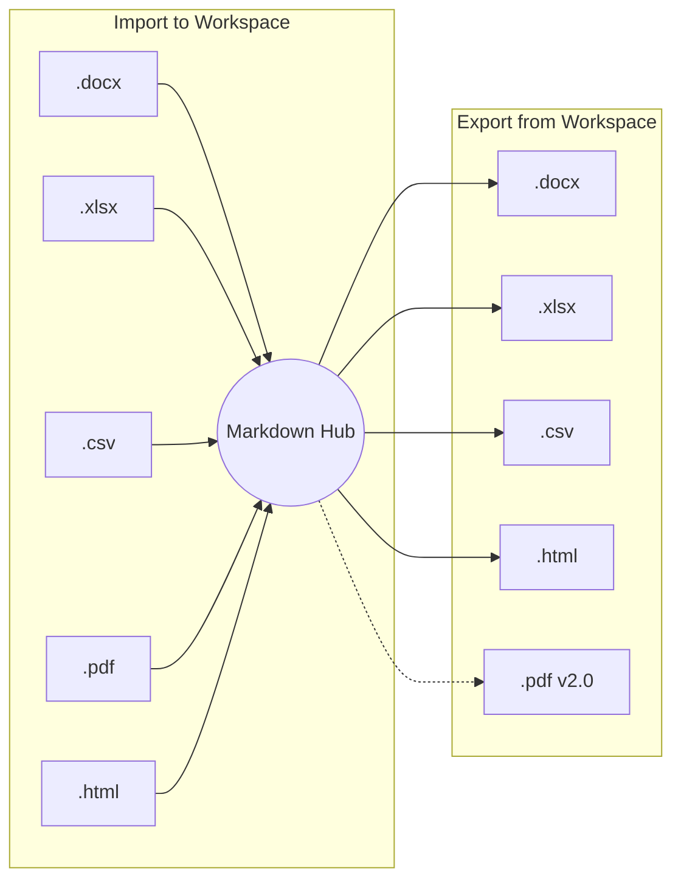

# Document Converter Workspace


A modern desktop workspace for editing and converting documents between **Markdown**, **Excel**, **Word**, **PDF**, **CSV**, and **HTML** formats built with **Flet (Flutter for Python)**.

The application provides a unified Markdown-centric workflow, allowing users to extract content from Office documents, edit it in Markdown, preview it live with optimized image resolution, and export it back into structured formats.

---

## Screenshots & Themes

| Dark Mode (Violet Cyberpunk) |      Light Mode (Light Theme)      |
| :--------------------------: | :---------------------------------: |
|  |  |

---

## Features

### Document Conversion

* **Markdown → Excel (.xlsx)**
  * Styled worksheet generation
  * Frozen header row
  * Auto-sized columns
  * Auto-filter support
* **Markdown → Word (.docx)**
  * Heading support
  * Lists support
  * Bold text support
  * Table rendering
* **Excel (.xlsx) → Markdown**
  * Multi-sheet extraction
  * Markdown table generation
* **Word (.docx) → Markdown**
  * Clean document extraction
  * Markdown-friendly formatting
* **PDF (.pdf) → Markdown**
  * Layout-preserving extraction with page-break table stitching
  * Multiline table cell continuation
  * Slide image extraction & `@media/` virtual URI management
* **CSV ↔ Markdown & HTML ↔ Markdown**
  * Delimiter auto-detection, clean CSV & HTML table parsing
  * GitHub-flavored CSS HTML styling

### Workspace Features (Flet UI Framework)

* Unified responsive split-pane Markdown editor & Live Document Preview.
* Native Windows File Picker with 8-category filter selection (`Word`, `Excel`, `PDF`, `Markdown`, `CSV`, `HTML`, `All Files`).
* Dynamic Mode Dropdown auto-filtering valid conversion options based on selected file extension.
* Instant 0ms Theme Switching across 5 curated Palettes (Emerald Obsidian, Violet Cyber, Deep Ocean, Slate Minimal, Amber Gold) with zero-lag container updates.
* Smart Hybrid Search & Replace with enter-key match cycling and editor focus highlighting.
* Real-time Async Loading (`asyncio.to_thread`) with live status progress indicator text.
* 1.5s Debounced Draft Autosave restoring buffer at `%APPDATA%\DocConvert\draft_autosave.md`.
* High-DPI aware (Per-Monitor v2 on Windows) for sharp text rendering.
* Cross-platform support (Windows, macOS, Linux).

---

## Supported Formats

The application uses **Markdown as a central interchange workspace**. You can import external documents into Markdown, edit them, and export them back to structured formats.



### Conversion Matrix

| Format                                    | Import to Markdown (`➔ .md`) | Export from Markdown (`.md ➔`) |      Mode      |  Status  |
| :---------------------------------------- | :-----------------------------: | :-------------------------------: | :------------: | :-------: |
| **Word Document (`.docx`)**       |               ✅               |                ✅                |   ↔ Two-Way   | ✅ Ready |
| **Excel Spreadsheet (`.xlsx`)**   |               ✅               |                ✅                |   ↔ Two-Way   | ✅ Ready |
| **CSV File (`.csv`)**             |               ✅               |                ✅                |   ↔ Two-Way   | ✅ Ready |
| **HTML Page (`.html`, `.htm`)** |               ✅               |                ✅                |   ↔ Two-Way   | ✅ Ready |
| **PDF Document (`.pdf`)**         |               ✅               |         🔄 Planned (v2.0)         | ➔ Import Only | ⚡ Active |

---

## Requirements

* Python 3.12 – 3.13
* Windows / macOS / Linux

---

## Installation & Running

```powershell
# Clone the repository
git clone https://github.com/duyphan1410/DocumentConvertTool.git
cd DocumentConvertTool

# Install dependencies
pip install -r requirements.txt

# Run application
python run.py
```

---

## Packaging to Executable (PyInstaller)

```powershell
# Recommended fail-safe packaging command:
python -m PyInstaller "Document Converter.spec"
```

The `.spec` file excludes heavy unused packages (`onnxruntime`, `cryptography`, `matplotlib`, `scipy`, etc.) for faster build times.

### Windows (Manual)

```cmd
pyinstaller --onefile --windowed --name "Document Converter" --icon=favicon.ico run.py
```

### macOS

```bash
pyinstaller --onefile --windowed --name "Document Converter" run.py
```

### Linux

```bash
pyinstaller --onefile --name "Document Converter" run.py
```

---

## Project Structure

```text
DocumentConvertTool/
│
├── assets/
│   └── icons/
│       └── app_icon.ico
│
├── docs/
│   ├── CONVERSION_PERFORMANCE_ANALYSIS.md
│   ├── PROJECT_SUMMARY.md
│   ├── REFACTORING_SUMMARY.md
│   ├── RIBBON_UI_SUMMARY.md
│   └── ROADMAP.md
│
├── src/
│   ├── __version__.py
│   ├── main.py
│   │
│   ├── core/
│   │   ├── base_module.py
│   │   ├── converters.py
│   │   ├── registry.py
│   │   └── validator.py
│   │
│   ├── modules/
│   │   ├── __init__.py
│   │   ├── csv_module.py
│   │   ├── excel_module.py
│   │   ├── html_module.py
│   │   ├── pdf_module.py
│   │   └── word_module.py
│   │
│   ├── services/
│   │   ├── conversion_service.py
│   │   ├── file_loader.py
│   │   └── media_asset_manager.py
│   │
│   ├── ui_flet/
│   │   ├── app.py
│   │   ├── constants.py
│   │   ├── native_dialogs.py
│   │   ├── state.py
│   │   ├── theme.py
│   │   │
│   │   ├── components/
│   │   │   ├── file_path_bar.py
│   │   │   ├── formatting_toolbar.py
│   │   │   └── search_replace_bar.py
│   │   │
│   │   ├── controllers/
│   │   │   ├── conversion_controller.py
│   │   │   ├── editor_controller.py
│   │   │   ├── file_controller.py
│   │   │   ├── layout_controller.py
│   │   │   ├── search_controller.py
│   │   │   └── theme_controller.py
│   │   │
│   │   ├── helpers/
│   │   │   └── shortcut_manager.py
│   │   │
│   │   ├── layout/
│   │   │   ├── footer_bar.py
│   │   │   ├── header_bar.py
│   │   │   └── ribbon_bar.py
│   │   │
│   │   └── views/
│   │       ├── editor_view.py
│   │       ├── preview_view.py
│   │       ├── welcome_view.py
│   │       └── workspace_view.py
│   │
│   └── utils/
│       ├── assets.py
│       └── env.py
│
├── tests/
│   ├── test_document_preview.py
│   ├── test_headless_launch.py
│   ├── test_optimizations.py
│   ├── test_smoke_imports.py
│   └── test_ui_formatting.py
│
├── run.py
├── requirements.txt
├── favicon.ico
├── Document Converter.spec
└── README.md
```

### Directory Overview

| Path                                             | Purpose                                                                    |
| :----------------------------------------------- | :------------------------------------------------------------------------- |
| `assets/icons/app_icon.ico`                    | Application icon for packaged executable                                   |
| `docs/`                                        | Developer documentation (roadmap, summaries, analysis reports)             |
| `src/__version__.py`                           | SemVer version config                                                      |
| `src/main.py`                                  | Application entry point & Flet initialization                              |
| `src/core/base_module.py`                      | Base abstract document module                                              |
| `src/core/registry.py`                         | Document module registry                                                   |
| `src/core/converters.py`                       | Markdown parsing utilities                                                 |
| `src/core/validator.py`                        | Document structure validation                                              |
| `src/modules/`                                 | Document conversion plugins (Word, Excel, CSV, PDF, HTML)                  |
| `src/services/`                                | Core conversion background services & Media Asset Manager                  |
| `src/ui_flet/app.py`                           | Main Flet UI orchestrator — wires all components, views & layout together |
| `src/ui_flet/constants.py`                     | Shared UI constants (sizes, spacing, key names)                            |
| `src/ui_flet/state.py`                         | Centralized application state dataclass                                    |
| `src/ui_flet/native_dialogs.py`                | Async Windows Native FileDialog helper (8 filter categories)               |
| `src/ui_flet/theme.py`                         | Flet UI 5-Palette Design Token & Theme Engine                              |
| `src/ui_flet/components/file_path_bar.py`      | File path display & open-in-explorer widget                                |
| `src/ui_flet/components/formatting_toolbar.py` | Markdown formatting toolbar (Bold, Italic, Heading, Table, …)             |
| `src/ui_flet/components/search_replace_bar.py` | Smart Hybrid Search & Replace panel with match cycling                     |
| `src/ui_flet/layout/header_bar.py`             | Top application header (title, theme switcher, window controls)            |
| `src/ui_flet/layout/ribbon_bar.py`             | Office-style Ribbon bar (File, Edit, View, Convert tabs)                   |
| `src/ui_flet/layout/footer_bar.py`             | Status bar (word count, cursor position, async progress indicator)         |
| `src/ui_flet/views/editor_view.py`             | Split-pane Markdown raw editor view                                        |
| `src/ui_flet/views/preview_view.py`            | Real-time Markdown Live Document Preview (RAM cache & image scaling)       |
| `src/utils/assets.py`                          | Asset path resolution helper (PyInstaller-aware)                           |
| `src/utils/env.py`                             | UTF-8 encoding, Tcl/Tk path & High-DPI configuration                       |
| `tests/`                                       | Automated test suite (smoke imports, UI formatting, headless launch)       |
| `Document Converter.spec`                      | Optimized PyInstaller build spec                                           |
| `run.py`                                       | Launcher script                                                            |

---

## Dependencies

| Library                  | Purpose                                              |
| :----------------------- | :--------------------------------------------------- |
| flet                     | Modern Flutter-based UI framework for Python         |
| python-docx              | Word document generation                             |
| openpyxl                 | Excel export/import                                  |
| pdfplumber / pymupdf     | PDF layout table extraction & slide image processing |
| markdown2 / markdown-pdf | Markdown ↔ HTML / PDF conversion                    |
| Pillow                   | Image processing & preview resolution scaling        |
| beautifulsoup4           | HTML document parsing & cleanup                      |

---

## Roadmap

### ✅ P0 — Stabilization (Completed)

* [X] Fix drag & drop path parser
* [X] File extension validation
* [X] Overwrite confirmation
* [X] Dependency fallback handling
* [X] Unsaved changes warning

### ✅ Phase 1 — UX & Format Improvements (Completed)

* [X] CSV ↔ Markdown support
* [X] Smart table validator (pipe escaping, table detection)
* [X] Search & replace panel (integrated into editor with Smart Hybrid focus)
* [X] Formatting toolbar in editor (Bold, Italic, Strikethrough, Code, Link, Headings, Lists, Tables)
* [X] Autosave draft (restore when reopening app, 1.5s debounce)

### ✅ Phase 2 — Flet UI & Format Expansion (Completed)

* [X] Modern Flet UI migration (responsive split-pane, 5 Palette themes, Dark/Light mode)
* [X] Async file loading (`asyncio.to_thread`) with real-time status feedback text
* [X] Native Windows FileDialog integration with 8 individual filetype filter categories
* [X] Dynamic Mode Dropdown option filtering according to selected file extension
* [X] Real-time Markdown Live Document Preview with RAM Caching (`_BASE64_CACHE`) & 68% Pillow scale optimization
* [X] PDF → Markdown (using pdfplumber + pymupdf layout extraction, preserving tables and slide images)
* [X] HTML ↔ Markdown (HTML export with GitHub Markdown CSS styling & import fallback)

### ✅ Phase 3 — 3-Tier Flet Architecture Refactor (Completed · v1.3.0)

* [X] Refactored monolithic `app.py` (907 lines → ~378 lines) into clean 3-tier modular layout
* [X] `layout/` layer — `header_bar.py`, `ribbon_bar.py`, `footer_bar.py` (application shell)
* [X] `components/` layer — `file_path_bar.py`, `search_replace_bar.py`, `formatting_toolbar.py` (reusable widgets)
* [X] `views/` layer — `editor_view.py`, `preview_view.py` (business panel views)
* [X] Centralized `state.py` AppState dataclass & shared `constants.py`
* [X] PyInstaller-aware asset path resolver (`src/utils/assets.py` + `assets/icons/app_icon.ico`)
* [X] Loading placeholder in Editor & ProgressBar in Preview during async file load
* [X] Smart "Copy Error" button on Footer (auto-shows on error, 1-click clipboard copy)
* [X] `[BENCHMARK]` timing logger — per-stage performance breakdown in terminal
* [X] UI freeze fix: `threading.Thread` → `asyncio.to_thread` reducing UI block from 20s → 2.39s

### ✅ Phase 4 — Office Ribbon UI & UX Polish (Completed · v1.3.1)

* [X] Office-style Ribbon Navbar (`ribbon_bar.py`) with 4 tabs: `File`, `Edit`, `View`, `Options`
* [X] Ribbon toggle: clicking the active tab collapses/expands the toolbar panel (zero layout shift, fixed `height=60`)
* [X] Heading Dropdown H1–H6 with `dense=True` sizing aligned to formatting toolbar buttons
* [X] Smart Image Insert button — opens Windows file picker & auto-inserts `` Markdown syntax
* [X] Removed 100% duplicate buttons across Ribbon, Header, and Footer
* [X] Live Preview 1-step lag fix: decoupled heavy extraction (`asyncio.to_thread`) from UI draw (main event loop)
* [X] Full Flet API 0.86.4+ compliance (`ft.Padding`, post-init `on_change`, `bgcolor` in `ButtonStyle`)
* [X] Automated test suite in `tests/` (5 files: smoke imports, UI formatting, headless launch, preview, optimizations)

### ✅ Phase 4.2 — Pure Orchestrator MVC Architecture & Welcome Dashboard (Completed · v1.3.2)

* [X] **Welcome Dashboard View (`welcome_view.py`)** — Centered onboarding card with **[Open Document]**, **[Create Blank Note]**, and theme palette integration when opening app without a draft/file.
* [X] **Workspace View Switcher (`workspace_view.py`)** — Dynamic container orchestrating seamless transitions between Welcome Screen and Editor Workspace.
* [X] **Editor Header Quick-Open (📂)** — 1-click file opening button directly in Editor header toolbar.
* [X] **Global Keyboard Shortcut (`Ctrl+O`)** — System-wide shortcut listener (`shortcut_manager.py`) to trigger file picker from any screen.
* [X] **Pure Orchestrator `app.py`** — Refactored `app.py` from ~450 lines down to ~120 lines, delegating business logic to 6 specialized controllers:
  * `SearchController` — Regex search & replace, line snippets, match cycling.
  * `FileController` — Async document loading, draft autosave/restoration, image insertion.
  * `ConversionController` — Worker execution, overwrite confirmation dialog, foreground file/folder launch.
  * `EditorController` — Text buffer management, Markdown formatting, Undo/Redo stack, non-destructive clear.
  * `ThemeController` — Palette switching, Light/Dark mode, Win32 OS title bar sync (`DwmSetWindowAttribute`).
  * `LayoutController` — Panel visibility toggles, dynamic min-lines editor height calculations.

### 🔄 Phase 4.1 — Two-Way Image Pipeline (In Progress)

* [ ] `MediaAssetManager` service — decode `@media/` URI tokens → Base64 RAM cache for live preview
* [ ] Word Exporter image embed — parse `@media/` tokens and embed images directly into `.docx` export (`word_module.py`)

### 📋 Phase 5–7 — v2.0 Roadmap (Planned)

* [ ] **Phase 5.1** — Multi-document tabs (`tab_bar.py`) & global keyboard shortcuts
* [ ] **Phase 5.2** — Markdown syntax highlighting in raw editor
* [ ] **Phase 6.1** — GitHub-styled Markdown → HTML → PDF engine (`pdf_exporter.py`, `sindresorhus/github-markdown-css`)
* [ ] **Phase 6.2** — Print Preview & A4 paginated print view (`print_view.py`)
* [ ] **Phase 6.3** — Batch & ZIP Converter (`batch_service.py`) for bulk folder/archive conversion
* [ ] **Phase 7.0** — CLI headless mode (`src/cli.py`) & Windows Setup Installer (`DocumentConverter_Setup_v2.0.0.exe` via Inno Setup)

---

## Known Limitations

* **Large files:** File preview display is optimized for smooth performance; full content will always be converted completely.
* **Complex Word formatting:** Advanced Word styles (columns, floating text boxes) are simplified into clean Markdown structure.
* **PDF support:** PDF import supports layout-preserving extraction with page-break table stitching and slide image extraction. Exporting Markdown to PDF is planned for v2.0.

---

## Development

Recommended branch strategy:

```text
main
├── fix/p0-stabilization
├── feature/flet-ui
└── feature/plugin-system
```

Commit example:

```bash
git commit -m "feat: migrate GUI to Flet UI with instant theme engine"
git commit -m "fix: optimize preview image scaling to 68% LANCZOS"
```

---

## Contributing

Contributions are welcome.

Before opening a Pull Request:

1. Follow PEP 8 conventions.
2. Add type hints to new APIs.
3. Test conversion workflows.
4. Keep UI responsive during long-running operations.

---

## License

MIT License

You are free to use, modify, distribute, and build upon this project under the terms of the MIT License.
