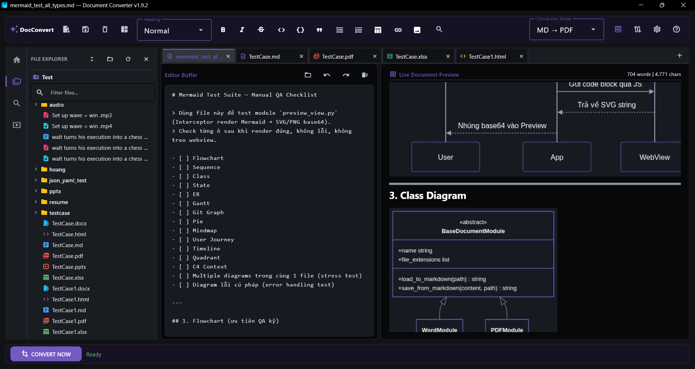
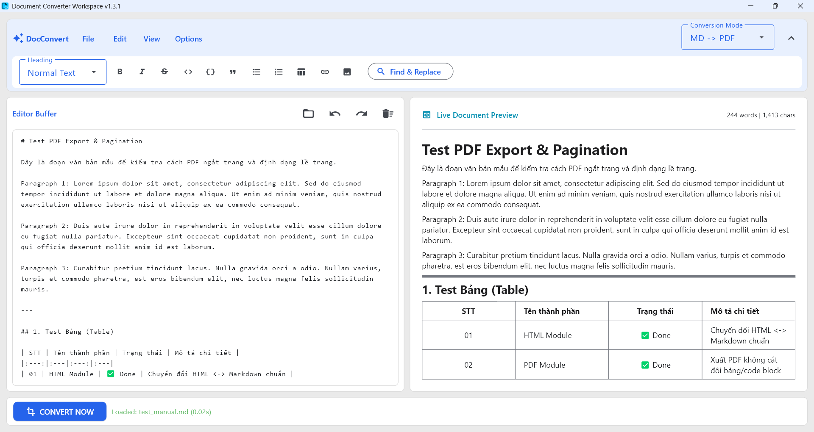

# Document Converter Workspace (v1.8.0)


A modern desktop workspace for editing and converting documents between **Markdown**, **PowerPoint**, **Excel**, **Word**, **PDF**, **CSV**, **HTML**, **JSON**, and **YAML** formats built with **Flet (Flutter for Python)**.

---

## 📥 Download

Download the latest standalone executable (no Python installation required):

➡️ [**Download Document Converter (v1.8.0) for Windows**](https://github.com/duyphan1410/DocumentConvertTool/releases/latest)

<small>⚠️ *Windows SmartScreen may warn because the application is unsigned. Click **More info → Run anyway** if prompted.*</small>

---

## 📸 Screenshots & Themes

| Dark Mode (Violet Cyberpunk) | Light Mode (Light Theme) |
| :--------------------------: | :---------------------------------: |
|  |  |

---

## ✨ Key Features

### 🗂️ Studio Workspace & File Management
* **Activity Bar Navigation**: Professional vertical dock (48px) with customizable left/right sidebar positioning, active highlight indicators, and workspace switcher.
* **File Explorer Sidebar**: Recursive workspace directory tree with extension-specific icon mapping, breadcrumb headers, single/double-click instant file opening, inline real-time search filter, and recursive *Collapse All Folders*.
* **Explorer Context Menu & Safe File Operations**: Floating right-click context menu with Win32 `SHFileOperationW` Recycle Bin deletion (zero data loss), Windows naming constraint validation, case-only rename support, unsaved changes (`is_dirty`) protection warnings, and new Markdown/Folder creation.
* **Smart 2-Tier Quick Convert**: 1-click direct conversion to Markdown for foreign files, and dynamic 8-format flyout submenu (`.docx`, `.pdf`, `.pptx`, `.html`, `.xlsx`, `.csv`, `.json`, `.yaml`) for `.md` files.
* **Responsive Header with Actions Dropdown**: Automatically transitions between inline action buttons and a sleek 3-dots (`...`) card dropdown menu when the sidebar width is contracted (< 210px).
* **Quick Open File Switcher (`Ctrl+P`)**: Blazing fast fuzzy file search modal palette across the entire project workspace with keyboard navigation (`Enter` to open, `Esc` to dismiss, click outside to close).
* **Smooth 60fps Draggable Splitters**: Dual responsive splitters for adjusting Sidebar width (150px–500px) and Editor/Preview ratio (20%–80%) with permanent configuration persistence and double-click balance reset (`50:50`).
* **Overhauled 2x2 Welcome Screen**: 4 large action cards (*Open Document*, *Open Project Folder*, *New Blank Note*, *YouTube Companion*) with physical `<kbd>` keyboard shortcut badges and high-contrast theme typography.

### 📄 Document Conversion Matrix

| Format | Import to Markdown (`➔ .md`) | Export from Markdown (`.md ➔`) | Highlights |
| :--- | :---: | :---: | :--- |
| **PowerPoint (`.pptx`)** | ✅ | ✅ | 16:9 Widescreen slides, auto-numbering, chart data extraction, legend padding, slide overflow protection, slide notes bullets |
| **Word (`.docx`)** | ✅ | ✅ | Styled headings, clean structure, tables |
| **Excel (`.xlsx`)** | ✅ | ✅ | Multi-sheet parsing, frozen headers, auto-filters |
| **PDF (`.pdf`)** | ✅ | ✅ | Geometric multi-column card tables, hierarchy tree alignment, SMask alpha compositing, shadow/halo artifact elimination, 20x fast thumbnail analysis |
| **CSV (`.csv`)** | ✅ | ✅ | Delimiter auto-detection, clean Markdown table generation |
| **HTML (`.html`)** | ✅ | ✅ | GitHub-flavored CSS styling, Pygments codehilite, safe regex code fence auto-repair |
| **JSON (`.json`)** | ✅ | ✅ | Tabular array-to-table conversion, nested key-value formatting, fenced code blocks |
| **YAML (`.yaml`, `.yml`)** | ✅ | ✅ | Structured tree formatting, pipe table conversion, safe PyYAML parsing |
| **YouTube (`URL`)** | ✅ | — | Multi-tier subtitle extraction: Tier 1 Subtitles & Server-side Auto-Translate (0% CPU/RAM), Tier 2 Non-AI Speech Recognition Fallback (`SpeechRecognition` + `yt-dlp`), oEmbed video metadata, interactive clickable timestamps & In-App Companion Player |

### 🎨 Modern Flet UI & Architecture
* **In-App YouTube Companion Player**: Dedicated Edge WebView2 mini player (`540x335`, 16:9) with interactive clickable timestamp seeking (`yt://...`), local HTTP bridge server (Error 153 immune), instant unmuted autoplay, and Win32 Z-Index #1 focus elevation.
* **Pure Orchestrator MVC Architecture**: Clean decoupling between `Views`, `Controllers` (7 specialized controllers), `AppState`, and `Layout`.
* **Simplified Single-Row Ribbon**: Ultra-compact 38–40px single-row ribbon with 100% Vector Icons, UX 4/8dp rhythm, and dynamic toggle visual states.
* **Direct Markdown Export & Quick Download**: 1-click `[⬇]` save to `.md` from editor buffer, instant footer actions (`Open File`, `Open Folder`).
* **Win32 Clipboard Integration**: Native Unicode-safe `CF_UNICODETEXT` reader with `Win + V` support and automatic URL detection.
* **Production Error Handling & Modal System**: Standardized `DocumentError` domain exceptions (10 `ErrorCode`s), `ErrorMapper` stage context, and theme-aware `MessageDialog` modals with Error ID tracking and one-click copy.
* **Single Responsibility Autosave Draft Protection**: Preserves `draft_autosave.md` safely across welcome screens, startup, and file loads; cancels pending timers before text clear; auto-detects YouTube transcripts on draft restore.
* **Card-Grid Help & Documentation View**: 2-column card grid layout, comprehensive shortcut cheatsheet, quick Markdown syntax reference, and custom left-aligned FAQ accordion.
* **Live Document Preview**: Real-time Base64 RAM cache & dynamic image scaling with zero UI freezing (`asyncio.to_thread`).
* **Universal Dynamic Win32 Focus & Browser Elevation**: 100% dynamic title-based window matching and `AttachThreadInput` Win32 API thread input attachment for seamless active focus across all Windows editors and web browsers.
* **Instant 5-Palette Theme Engine**: Deep Ocean, Violet Cyberpunk, Emerald Obsidian, Slate Minimal, Amber Gold.

---

## 🚀 Quick Start

### Installation & Running

```powershell
# Clone the repository
git clone https://github.com/duyphan1410/DocumentConvertTool.git
cd DocumentConvertTool

# Install dependencies
pip install -r requirements.txt

# Run application
python run.py
```

### Packaging & Installer (PyInstaller + Inno Setup 7)

```powershell
# 1-Click Automated Build (PyInstaller --onedir + Inno Setup 7 Setup.exe)
powershell -ExecutionPolicy Bypass -File .\scripts\build_installer.ps1

# Or manual PyInstaller --onedir build
python -m PyInstaller "Document Converter.spec"
```
The standalone desktop bundle will be generated at `dist/Document Converter/` and the Windows installer at `dist/installer/Document_Converter_Setup_v1.7.2.exe`.

---

## 🗺️ Version History

- **v1.0 — Core Engines**: Initial Word, Excel, CSV, PDF, HTML conversion modules.
- **v1.3 — Flet Desktop Migration**: Responsive split-pane layout, 5-palette theme engine, async loader.
- **v1.4 — Pure MVC & PDF Engine Polish**: 3-Tier MVC architecture (6 Controllers), Welcome Dashboard, Office Ribbon Bar, PDF list preservation & Vietnamese font fix.
- **v1.5 — Error Handling, Draft Protection & Auto-Loading UX**: 10 `ErrorCode`s, autosave draft protection, 60fps async loading view, 1-click smart auto-rename & localized path bar.
- **v1.6 — PowerPoint Engine, Universal Dynamic Focus & Browser Elevation**: Bi-directional PPTX ↔ MD engine (16:9 widescreen, auto-numbering, chart extraction, legend padding, slide overflow protection), 100% dynamic Win32 window focus & `AttachThreadInput` browser elevation.
- **v1.6.5 — JSON & YAML Modules**: Bi-directional JSON ↔ MD & YAML ↔ MD conversion plugins (pipe table conversion, nested object tree formatting, code block fallback, safe PyYAML lazy loading).
- **v1.6.6 — PDF Card Table Layout, Image Artifact Filter & High-Speed Pipeline**: N-column spatial card table router ($N=2..5$), hierarchy tree alignment, illustration pseudo-table linguistic guard, Polaroid blank core frame filter, button glow/halo filter, and thumbnail downsampling (20x faster).
- **v1.7.0 — YouTube Extractor, Direct MD Export, Single-Row Ribbon & Studio UI**: Multi-tier YouTube Subtitle & Non-AI Speech Transcriber, direct Markdown file download (`[⬇]`) & save flow, Win32 Clipboard auto-fill (`Win + V`), simplified single-row Ribbon Bar (38–40px), dynamic toggle visual states, native directory picker dialogs, single-row File Path Bar, JSON/YAML multiline & escape sequence fixes, and card-grid Help View.
- **v1.7.2 — YouTube Companion Player & Inno Setup 7 Desktop Installer**: Embedded Microsoft Edge WebView2 Mini Player (`540x335`, 16:9) with clickable transcript timestamps (`yt://...`), local HTTP bridge server eliminating YouTube Error 153, instant unmuted autoplay, Win32 dynamic focus elevation, auto YouTube draft detection, and Inno Setup 7 modern installer (`--onedir`, `< 1s` instant launch, non-admin `%LocalAppData%\Programs` support).
- **v1.8.0 / v1.8.1a — Studio Workspace, Activity Bar, Explorer Context Menu & Safe File Ops (Current)**: Full IDE-grade transformation with Activity Bar dock, recursive File Explorer tree, Quick Open fuzzy search modal (`Ctrl+P`), 60fps Dual Draggable Splitters with ratio persistence, 2x2 Welcome Screen, floating right-click Context Menu, Win32 `SHFileOperationW` Recycle Bin deletion, 2-Tier Quick Convert (8 export formats), and responsive compact actions dropdown.


> [!NOTE]
> Detailed developer documentation, technical architecture summaries, and feature logs are organized in the [`docs/`](docs/) directory.

---

## ⚠️ Known Limitations

* **Windows Clipboard History (`Win + V`):** Due to Windows OS architecture, the `Win + V` clipboard panel is rendered in an isolated system shell process that de-focuses the application upon opening. Please use the standard **`Ctrl + V`** or right-click **Paste** to insert text from the clipboard.
* **Drag & Drop:** Dragging files directly from Windows File Explorer onto the application window is currently not supported in Flet Desktop; please use the **Open Document** button (`Ctrl+O`) to load files.
* **Large Documents:** Document preview is optimized for smooth editing performance; full file contents are converted completely during processing.
* **Complex Styles:** Advanced Office layout elements (floating text boxes, multi-column macros) are simplified into clean, standardized Markdown structures.

---

## 👥 Authors & Contributors

* **Duy Phan** ([@duyphan1410](https://github.com/duyphan1410)) — Core Architecture, UI Framework & Conversion Service Lead.
* **Satoou19 (Huy)** — Document Modules Overhaul, PDF & Image Handling Specialist.

---

## 📄 License

GNU AGPLv3 — Copyright (c) 2026 Duy Phan & Contributors
