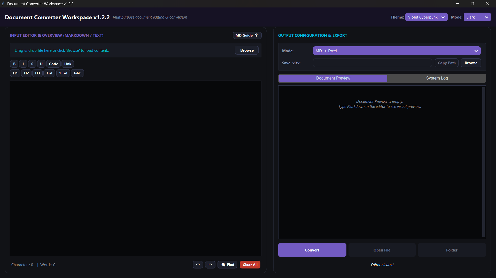
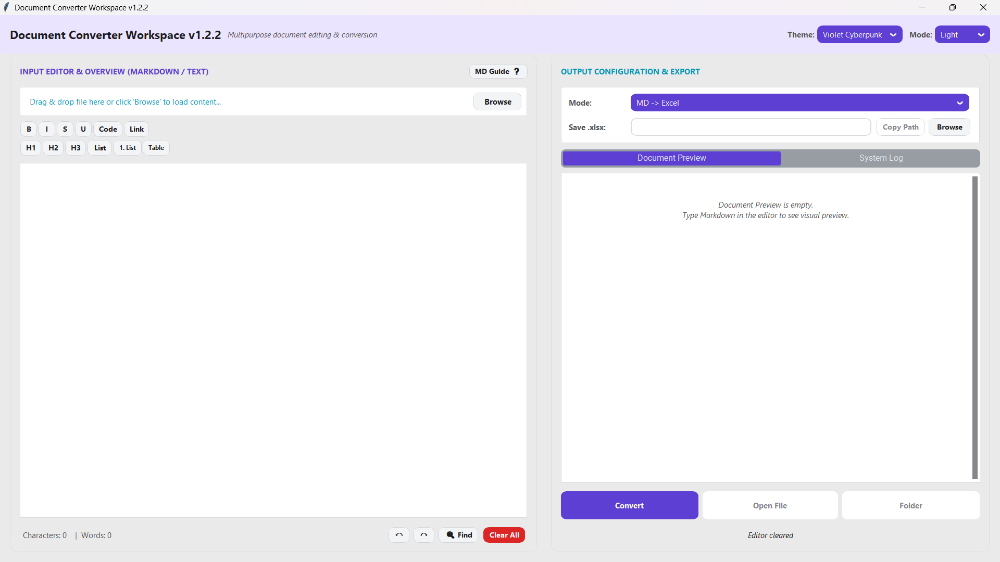
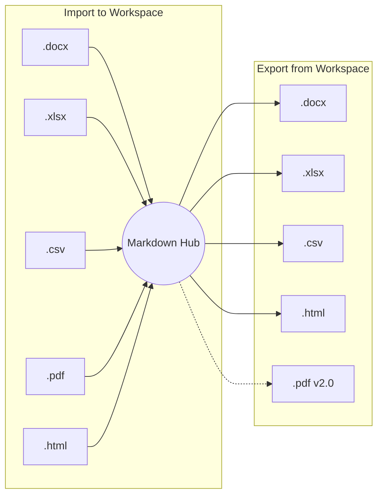

# Document Converter Workspace


A modern desktop workspace for editing and converting documents between **Markdown**, **Excel**, **Word**, **PDF**, **CSV**, and **HTML** formats built with **Flet (Flutter for Python)**.

The application provides a unified Markdown-centric workflow, allowing users to extract content from Office documents, edit it in Markdown, preview it live with optimized image resolution, and export it back into structured formats.

---

## Screenshots & Themes

| Dark Mode (Violet Cyberpunk) |      Light Mode (Light Theme)      |
| :--------------------------: | :---------------------------------: |
|  |  |

---

## Features

### Document Conversion

* **Markdown → Excel (.xlsx)**
  * Styled worksheet generation
  * Frozen header row
  * Auto-sized columns
  * Auto-filter support
* **Markdown → Word (.docx)**
  * Heading support
  * Lists support
  * Bold text support
  * Table rendering
* **Excel (.xlsx) → Markdown**
  * Multi-sheet extraction
  * Markdown table generation
* **Word (.docx) → Markdown**
  * Clean document extraction
  * Markdown-friendly formatting
* **PDF (.pdf) → Markdown**
  * Layout-preserving extraction with page-break table stitching
  * Multiline table cell continuation
  * Slide image extraction & `@media/` virtual URI management
* **CSV ↔ Markdown & HTML ↔ Markdown**
  * Delimiter auto-detection, clean CSV & HTML table parsing
  * GitHub-flavored CSS HTML styling

### Workspace Features (Flet UI Framework)

* Unified responsive split-pane Markdown editor & Live Document Preview.
* Native Windows File Picker with 8-category filter selection (`Word`, `Excel`, `PDF`, `Markdown`, `CSV`, `HTML`, `All Files`).
* Dynamic Mode Dropdown auto-filtering valid conversion options based on selected file extension.
* Instant 0ms Theme Switching across 5 curated Palettes (Emerald Obsidian, Violet Cyber, Deep Ocean, Slate Minimal, Amber Gold) with zero-lag container updates.
* Smart Hybrid Search & Replace with enter-key match cycling and editor focus highlighting.
* Real-time Async Loading (`asyncio.to_thread`) with live status progress indicator text.
* 1.5s Debounced Draft Autosave restoring buffer at `%APPDATA%\DocConvert\draft_autosave.md`.
* High-DPI aware (Per-Monitor v2 on Windows) for sharp text rendering.
* Cross-platform support (Windows, macOS, Linux).

---

## Supported Formats

The application uses **Markdown as a central interchange workspace**. You can import external documents into Markdown, edit them, and export them back to structured formats.



### Conversion Matrix

| Format | Import to Markdown (`➔ .md`) | Export from Markdown (`.md ➔`) | Mode | Status |
| :--- | :---: | :---: | :---: | :---: |
| **Word Document (`.docx`)** | ✅ | ✅ | ↔ Two-Way | ✅ Ready |
| **Excel Spreadsheet (`.xlsx`)** | ✅ | ✅ | ↔ Two-Way | ✅ Ready |
| **CSV File (`.csv`)** | ✅ | ✅ | ↔ Two-Way | ✅ Ready |
| **HTML Page (`.html`, `.htm`)** | ✅ | ✅ | ↔ Two-Way | ✅ Ready |
| **PDF Document (`.pdf`)** | ✅ | 🔄 Planned (v2.0) | ➔ Import Only | ⚡ Active |

---

## Requirements

* Python 3.12 – 3.13
* Windows / macOS / Linux

---

## Installation & Running

```powershell
# Clone the repository
git clone https://github.com/duyphan1410/DocumentConvertTool.git
cd DocumentConvertTool

# Install dependencies
pip install -r requirements.txt

# Run application
python run.py
```

---

## Packaging to Executable (PyInstaller)

```powershell
# Recommended fail-safe packaging command:
python -m PyInstaller "Document Converter.spec"
```
The `.spec` file excludes heavy unused packages (`onnxruntime`, `cryptography`, `matplotlib`, `scipy`, etc.) for faster build times.

### Windows (Manual)

```cmd
pyinstaller --onefile --windowed --name "Document Converter" --icon=favicon.ico run.py
```

### macOS

```bash
pyinstaller --onefile --windowed --name "Document Converter" run.py
```

### Linux

```bash
pyinstaller --onefile --name "Document Converter" run.py
```

---

## Project Structure

```text
DocumentConvertTool/
│
├── src/
│   ├── __version__.py
│   ├── main.py
│   │
│   ├── core/
│   │   ├── base_module.py
│   │   ├── converters.py
│   │   ├── registry.py
│   │   └── validator.py
│   │
│   ├── modules/
│   │   ├── __init__.py
│   │   ├── csv_module.py
│   │   ├── excel_module.py
│   │   ├── html_module.py
│   │   ├── pdf_module.py
│   │   └── word_module.py
│   │
│   ├── services/
│   │   ├── conversion_service.py
│   │   ├── file_loader.py
│   │   └── media_asset_manager.py
│   │
│   ├── ui_flet/
│   │   ├── app.py
│   │   ├── native_dialogs.py
│   │   ├── preview.py
│   │   └── theme.py
│   │
│   └── utils/
│       └── env.py
│
├── run.py
├── requirements.txt
├── favicon.ico
├── Document Converter.spec
└── README.md
```

### Directory Overview

| Path | Purpose |
| :--- | :--- |
| `src/__version__.py` | SemVer version config |
| `src/main.py` | Application entry point & Flet initialization |
| `src/core/base_module.py` | Base abstract document module |
| `src/core/registry.py` | Document module registry |
| `src/core/converters.py` | Markdown parsing utilities |
| `src/core/validator.py` | Document structure validation |
| `src/modules/` | Document conversion plugins (Word, Excel, CSV, PDF, HTML) |
| `src/services/` | Core conversion background services & Media Asset Manager |
| `src/ui_flet/app.py` | Main Flet UI Desktop Application (responsive split-pane) |
| `src/ui_flet/native_dialogs.py` | Async Windows Native FileDialog helper (8 filter categories) |
| `src/ui_flet/preview.py` | Real-time Markdown Live Document Preview (RAM cache & 68% image scale) |
| `src/ui_flet/theme.py` | Flet UI 5-Palette Design Token & Theme Engine |
| `src/utils/env.py` | UTF-8 encoding, Tcl/Tk path & High-DPI configuration |
| `Document Converter.spec` | Optimized PyInstaller build spec |
| `run.py` | Launcher script |

---

## Dependencies

| Library | Purpose |
| :--- | :--- |
| flet | Modern Flutter-based UI framework for Python |
| python-docx | Word document generation |
| openpyxl | Excel export/import |
| pdfplumber / pymupdf | PDF layout table extraction & slide image processing |
| markdown2 / markdown-pdf | Markdown ↔ HTML / PDF conversion |
| Pillow | Image processing & preview resolution scaling |
| beautifulsoup4 | HTML document parsing & cleanup |

---

## Roadmap

### ✅ P0 — Stabilization (Completed)

* [x] Fix drag & drop path parser
* [x] File extension validation
* [x] Overwrite confirmation
* [x] Dependency fallback handling
* [x] Unsaved changes warning

### ✅ Phase 1 — UX & Format Improvements (Completed)

* [x] CSV ↔ Markdown support
* [x] Smart table validator (pipe escaping, table detection)
* [x] Search & replace panel (integrated into editor with Smart Hybrid focus)
* [x] Formatting toolbar in editor (Bold, Italic, Strikethrough, Code, Link, Headings, Lists, Tables)
* [x] Autosave draft (restore when reopening app, 1.5s debounce)

### ✅ Phase 2 — Flet UI & Format Expansion (Completed)

* [x] Modern Flet UI migration (responsive split-pane, 5 Palette themes, Dark/Light mode)
* [x] Async file loading (`asyncio.to_thread`) with real-time status feedback text
* [x] Native Windows FileDialog integration with 8 individual filetype filter categories
* [x] Dynamic Mode Dropdown option filtering according to selected file extension
* [x] Real-time Markdown Live Document Preview with RAM Caching (`_BASE64_CACHE`) & 68% Pillow scale optimization
* [x] PDF → Markdown (using pdfplumber + pymupdf layout extraction, preserving tables and slide images)
* [x] HTML ↔ Markdown (HTML export with GitHub Markdown CSS styling & import fallback)

### 🔄 Phase 3–5 — v2.0 Roadmap (Planned)

* [ ] Two-Way Image Pipeline (Word/PDF/HTML 2-way image import & export)
* [ ] Multi-document tabs & global keyboard shortcuts
* [ ] Markdown syntax highlighting in raw editor
* [ ] Markdown → PDF (with embedded image & table rendering)
* [ ] Command-Line Interface (CLI mode)
* [ ] Optimized `Document Converter.spec` build & Windows Setup Installer (`DocumentConverter_Setup_v2.0.0.exe` via Inno Setup)

---

## Known Limitations

* **Large files:** File preview display is optimized for smooth performance; full content will always be converted completely.
* **Complex Word formatting:** Advanced Word styles (columns, floating text boxes) are simplified into clean Markdown structure.
* **PDF support:** PDF import supports layout-preserving extraction with page-break table stitching and slide image extraction. Exporting Markdown to PDF is planned for v2.0.

---

## Development

Recommended branch strategy:

```text
main
├── fix/p0-stabilization
├── feature/flet-ui
└── feature/plugin-system
```

Commit example:

```bash
git commit -m "feat: migrate GUI to Flet UI with instant theme engine"
git commit -m "fix: optimize preview image scaling to 68% LANCZOS"
```

---

## Contributing

Contributions are welcome.

Before opening a Pull Request:

1. Follow PEP 8 conventions.
2. Add type hints to new APIs.
3. Test conversion workflows.
4. Keep UI responsive during long-running operations.

---

## License

MIT License

You are free to use, modify, distribute, and build upon this project under the terms of the MIT License.
