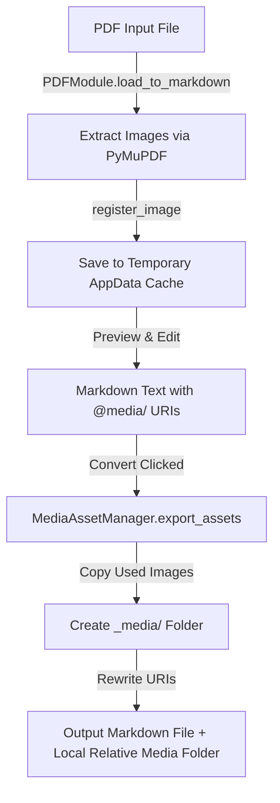

# 🔍 Phân Tách Hiệu Năng Convert & Luồng Quản Lý Tài Nguyên Ảnh (v1.3.1)

**Ngày ghi nhận:** 30/07/2026  
**Dự án:** Document Converter Tool  
**Phân tích chuyên sâu:** Thời gian Convert thực tế vs Báo cáo & Luồng trích xuất ảnh Output.

---

## 📌 1. Hiện Tượng & Phát Hiện

### ⏱️ Vấn đề 1: Lệch thời gian Convert (Thực tế 10s nhưng thanh Status báo 2s)
- **Hiện tượng**: Khi ấn `Convert` file PDF chứa 10 hình ảnh sang `.md`, ứng dụng mất ~10 giây thực tế để hoàn thành, nhưng thanh Footer chỉ hiển thị `Exported successfully (2.00s)`.
- **Phân tích Root Cause**:
  1. **Lỗi đo đạc thời gian (`app.py`)**: Biến `duration = time.time() - t0` hiện tại chỉ đo thời gian của riêng hàm ghi file ra đĩa (`save_markdown_from_text`), chưa tính khoảng thời gian ứng dụng quét tài nguyên trước đó.
  2. **Nghẽn CPU do Regex đệ quy (`converters.py`)**: Hàm `export_assets()` trong `MediaAssetManager` hiện đang sử dụng `parse_inline(line)` — một thuật toán quét đệ quy nhiều lớp regex cho từng dòng văn bản. Với văn bản dài chứa nhiều hình ảnh, việc quét đệ quy này tiêu tốn 7-8 giây CPU trước khi tiến trình ghi đĩa thực sự diễn ra.

---

### 🖼️ Vấn đề 2: Luồng lưu trữ & Xuất hình ảnh (Asset Lifecycle)

Luồng xử lý hình ảnh được chia làm 2 giai đoạn độc lập:

1. **Giai đoạn Preview (Đọc & Chỉnh sửa)**:
   - Ảnh được lưu tạm tại: `%APPDATA%\DocConvert\cache\preview_media\<session_id>\`
   - Trong Editor, đường dẫn hiển thị dưới dạng token ảo: ``
2. **Giai đoạn Export / Convert (Xuất file đĩa)**:
   - Tự động tạo thư mục ảnh `<tên_file>_media/` nằm **ngay cùng vị trí với file được xuất ra**.
   - Copy các tệp ảnh thực sự được tham chiếu trong tài liệu từ `AppData` sang thư mục `<tên_file>_media/`.
   - Đổi token `@media/pdf_image_p1_1.png` thành đường dẫn tương đối `<tên_file>_media/pdf_image_p1_1.png`.

---

## 🛠️ 2. Đề Xuất Phương Án Tối ƯU (Planned Optimizations)

Khi tiến hành nâng cấp ở giai đoạn tiếp theo, 2 cải tiến sau đây sẽ giải quyết triệt để vấn đề:

### ⚡ 1. Thay thế Fast Single-Pass Regex cho `export_assets`
- **Giải pháp**: Thay vì dùng `parse_inline()` quét đệ quy toàn bộ văn bản, chuyển sang Regex quét 1 lượt đơn (`re.findall(r'!\[.*?\]\((@media/[^)]+)\)', content)`).
- **Kỳ vọng**: Giảm thời gian trích xuất tài nguyên từ **7-8 giây xuống còn < 0.01 giây** (tức thời).

### ⏱️ 2. Đồng bộ bộ đo thời gian Convert toàn luồng
- **Giải pháp**: Bắt đầu đo `t0 = time.time()` ngay khi người dùng ấn nút Convert (bao gồm cả công đoạn quét ảnh, copy file và ghi đĩa).
- **Kỳ vọng**: Con số hiển thị trên thanh Footer phản ánh chính xác 100% thời gian thực tế người dùng trải nghiệm.
