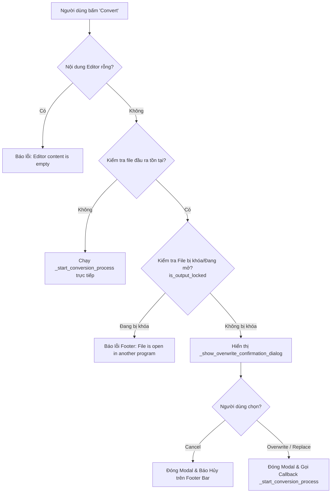

# Document Logic Dialog Popup Modal Check Overwrite

Tài liệu này tổng hợp và giải thích chi tiết toàn bộ kiến trúc, quy trình xử lý và mã nguồn logic của tính năng **Check Overwrite & Confirmation Dialog Popup Modal** trong ứng dụng **DocumentConvertTool** (Flet UI & Win32 Native Dialogs).

---

## 1. Tổng quan Kiến trúc & Quy trình (Workflow)

Khi người dùng thực hiện chuyển đổi tài liệu (ấn nút **Convert**), ứng dụng trải qua các bước kiểm tra an toàn ghi đè (Overwrite Safety Check) như sau:



---

## 2. Chi tiết các Thành phần Logic Code

### 2.1. Kiểm tra trạng thái File bị khóa (`src/services/conversion_service.py`)

Hàm `is_output_locked(out_path)` thực hiện thử mở file ở chế độ đọc/ghi nhị phân (`r+b`). Nếu hệ điều hành quăng ngoại lệ `PermissionError` (do file đang được mở trong MS Word, Excel, hoặc chương trình khác), hàm trả về `True`.

```python
# Location: src/services/conversion_service.py

def is_output_locked(out_path: str) -> bool:
    """
    Kiểm tra xem file đầu ra có đang bị khóa bởi ứng dụng khác (vd: MS Word, Excel) hay không.
    Trả về True nếu bị locked (PermissionError), ngược lại False.
    """
    if not os.path.exists(out_path):
        return False
    try:
        with open(out_path, "r+b"):
            return False
    except PermissionError:
        return True
    except Exception:
        return False
```

---

### 2.2. Modal Dialog Giao diện Flet UI (`src/ui_flet/app.py`)

Phần xử lý sự kiện chuyển đổi và khởi tạo Modal Popup trong `app.py`:

#### 2.2.1. Sự kiện kích hoạt kiểm tra khi nhấn Convert (`_on_convert_clicked`)

```python
# Location: src/ui_flet/app.py

    def _on_convert_clicked(self, e):
        t0 = time.time()  # Bắt đầu tính thời gian chuyển đổi

        content = self.editor_view.get_text()
        if not content or not content.strip():
            self.footer_bar.set_status("Editor content is empty! Please type or load a document.", ft.Colors.RED_400)
            return

        raw_out = self.file_path_bar.out_path_text.value or ""
        out_path = raw_out.strip('"\' ')
        if not out_path:
            mode_cfg = MODES.get(self.state.current_mode, {})
            out_ext = mode_cfg.get("out_ext", ".html")
            docs_dir = os.path.expanduser("~/Documents")
            if not os.path.exists(docs_dir):
                docs_dir = os.getcwd()
            fallback_path = os.path.normpath(os.path.join(docs_dir, f"Converted_Draft{out_ext}"))
            out_path = fallback_path
            self.state.out_path = fallback_path
            self.file_path_bar.set_out_path(fallback_path)

        out_path = os.path.normpath(out_path)
        print(f"[DEBUG] Convert clicked: out_path='{out_path}', exists={os.path.exists(out_path)}")

        # 1. Kiểm tra xem file đã tồn tại trên đĩa chưa
        if os.path.exists(out_path):
            # 2. Kiểm tra nếu file đang bị khóa bởi tiến trình khác
            if is_output_locked(out_path):
                file_name = os.path.basename(out_path)
                self.footer_bar.set_status(
                    f"Cannot overwrite! File '{file_name}' is currently open in another program. Please close the file and try again.",
                    ft.Colors.RED_400,
                    is_error=True,
                )
                return
            
            # 3. Hiển thị Dialog Popup Modal hỏi xác nhận ghi đè
            self._show_overwrite_confirmation_dialog(
                out_path,
                on_confirm_callback=lambda: self._start_conversion_process(content, out_path, t0)
            )
            return

        # 4. Nếu file chưa tồn tại, tiến hành chuyển đổi ngay
        self._start_conversion_process(content, out_path, t0)
```

#### 2.2.2. Khởi tạo và xử lý Overwrite Confirmation Dialog Modal (`_show_overwrite_confirmation_dialog`)

Dialog được thiết kế chuẩn theo Theme/Palette hiện tại của ứng dụng, hỗ trợ cả Dark/Light mode:

```python
# Location: src/ui_flet/app.py

    def _show_overwrite_confirmation_dialog(self, out_path: str, on_confirm_callback):
        """Shows a Flet AlertDialog styled with current palette for file overwrite confirmation."""
        from src.ui_flet.theme import resolve_color, get_style_color
        palette = PALETTES.get(self.state.current_palette, PALETTES.get("Violet Cyberpunk", {}))
        is_dark = self.page.theme_mode != ft.ThemeMode.LIGHT

        bg_card = resolve_color(palette, "bg_component", is_dark)
        bg_pill = resolve_color(palette, "bg_header", is_dark)
        accent_color = resolve_color(palette, "text_accent_secondary", is_dark)
        text_primary = get_style_color("text_primary", is_dark)
        text_secondary = get_style_color("text_secondary", is_dark)
        border_color = resolve_color(palette, "border_color", is_dark)

        file_name = os.path.basename(out_path)

        def close_dialog(e, confirmed: bool):
            print("[DEBUG] Closing overwrite dialog")

            dialog.open = False
            self.page.update()

            if confirmed:
                on_confirm_callback()
            else:
                self.footer_bar.set_status(
                    "Conversion cancelled: File overwrite rejected.",
                    ft.Colors.AMBER_400,
                )

        dialog = ft.AlertDialog(
            modal=True,
            title=ft.Row(
                controls=[
                    ft.Icon(ft.Icons.WARNING_ROUNDED, color=ft.Colors.AMBER_400, size=24),
                    ft.Text("Confirm File Overwrite", weight=ft.FontWeight.BOLD, size=18, color=text_primary),
                ],
                spacing=10,
            ),
            content=ft.Container(
                content=ft.Column(
                    controls=[
                        ft.Text(
                            "The target output file already exists on disk:",
                            size=13,
                            color=text_secondary,
                        ),
                        ft.Container(
                            content=ft.Text(
                                file_name,
                                weight=ft.FontWeight.W_600,
                                size=13,
                                color=accent_color,
                                overflow=ft.TextOverflow.ELLIPSIS,
                            ),
                            padding=10,
                            bgcolor=bg_pill,
                            border_radius=6,
                            border=make_border(1, border_color),
                        ),
                        ft.Text(
                            "Do you want to overwrite and replace this file?",
                            size=13,
                            color=text_secondary,
                        ),
                    ],
                    tight=True,
                    spacing=12,
                ),
                width=420,
            ),
            actions=[
                ft.TextButton(
                    "Cancel",
                    on_click=lambda e: close_dialog(e, False),
                    style=ft.ButtonStyle(color=text_secondary),
                ),
                ft.Button(
                    "Overwrite / Replace",
                    icon=ft.Icons.AUTORENEW_ROUNDED,
                    on_click=lambda e: close_dialog(e, True),
                    style=ft.ButtonStyle(
                        color=ft.Colors.WHITE,
                        bgcolor=ft.Colors.RED_600,
                    ),
                ),
            ],
            actions_alignment=ft.MainAxisAlignment.END,
            bgcolor=bg_card,
            shape=ft.RoundedRectangleBorder(radius=10),
        )

        if dialog not in self.page.overlay:
            self.page.overlay.append(dialog)
        self.page.dialog = dialog
        dialog.open = True
        self.page.update()
```

---

### 2.3. Native Win32 / Tkinter Fallback Overwrite Dialog (`src/ui_flet/native_dialogs.py`)

Ngoài ra, ứng dụng còn hỗ trợ Dialog ghi đè native của Windows (hỗ trợ Per-Monitor DPI v2):

```python
# Location: src/ui_flet/native_dialogs.py

def confirm_overwrite_sync(file_path: str) -> bool:
    """Prompts a native Windows messagebox asking user if they want to overwrite an existing file."""
    try:
        import tkinter as tk
        from tkinter import messagebox
        enable_high_dpi_awareness()
        root = tk.Tk()
        root.withdraw()
        root.attributes("-topmost", True)
        res = messagebox.askyesno(
            "Confirm Overwrite",
            f"The file '{os.path.basename(file_path)}' already exists.\n\nDo you want to overwrite it?",
            parent=root
        )
        root.destroy()
        return res
    except Exception as e:
        print(f"[DEBUG] confirm_overwrite_sync error: {e}")
        return True


async def confirm_overwrite_async(file_path: str) -> bool:
    """Async wrapper for confirm_overwrite_sync."""
    return await asyncio.to_thread(confirm_overwrite_sync, file_path)
```

Tương tự, hàm chọn vị trí lưu file Native `pick_output_file_sync` cũng tích hợp cờ `confirmoverwrite=True`:

```python
# Location: src/ui_flet/native_dialogs.py (Snippet)

save_path = filedialog.asksaveasfilename(
    title="Select Output Destination",
    defaultextension=default_ext,
    initialfile=initial_file,
    filetypes=OUTPUT_FILETYPES,
    confirmoverwrite=True,  # Tự động bật dialog xác nhận ghi đè của Windows File Explorer
)
```

---

## 3. Điểm nổi bật trong Thiết kế & Xử lý UX/UI

1. **Kiểm tra File Lock trước (Pre-check File Lock)**: Tránh tình trạng người dùng xác nhận "Overwrite" nhưng ứng dụng bị crash hoặc lỗi giữa chừng do file đang mở trong Word/Excel.
2. **Dynamic Styling trong Modal Popup**: Modal Dialog cập nhật màu nền, chữ, viền và các điểm nhấn theo từng Palette chủ đề được chọn (Cyberpunk, Midnight Teal, Slate, v.v.).
3. **Async Non-blocking**: Dialog hoạt động mượt mà trong Event Loop của Flet, callback `_start_conversion_process` chỉ được kích hoạt asynchronous khi bấm nút "Overwrite / Replace".
4. **Thông báo trạng thái rõ ràng**: Khi người dùng chọn "Cancel", Footer Bar phản hồi tức thì với màu Amber cảnh báo: *"Conversion cancelled: File overwrite rejected."*.
