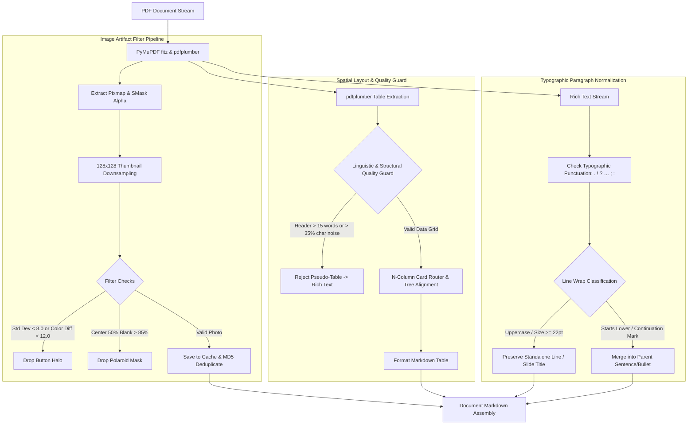

# 🏛️ Architecture Decision Record: PDF Card Layout Engine & Image Artifact Pipeline

**Document ID:** ADR-009  
**Date:** 17/08/2026  
**Status:** ACCEPTED  
**Module:** `src/modules/pdf_module.py`

---

## 1. Context & Problem Statement

When converting complex presentation slides and vector-heavy PDFs into Markdown:
1. **Multi-Column Card Grids & Tree Diagrams:** PDF rendering lacks DOM structure. Text blocks separated horizontally by margins ($\Delta X \ge 20\text{px}$) were extracted as fragmented linear text streams, or incorrectly merged into disordered paragraphs.
2. **Polaroid Shadow Masks & Button Glows:** Presentation slides often use multi-layered rendering: transparent Polaroid shadow frames (`smask` with solid white centers) and blurry drop-shadow glow halos (`std_dev < 8.0`). These bloated extracted image counts (218 images vs ~147 actual content photos).
3. **Illustration Pseudo-Tables:** Vector line drawings (e.g. boat hull / sinking ship illustrations) were falsely classified as 2-row tables by `pdfplumber`, resulting in scrambled rotated text noise.
4. **Performance Bottleneck:** Analyzing high-resolution 2K/4K background images with NumPy array operations during shadow filtering introduced a 30+ second CPU bottleneck.

---

## 2. Architectural Design & Implementation

### Key Technical Pillars

#### A. N-Column Spatial Card Router & Hierarchy Tree Alignment
- Calculates horizontal bounding box gaps ($\Delta X \ge 20\text{px}$) to group items into 2, 3, 4, or 5 column matrix blocks.
- Implements Hierarchy Root Node detection: detects when row 0 has a single centered category title (e.g. `Construction`) while sub-items span 3 sub-columns, expanding headers symmetrically.

#### B. Linguistic & Structural Quality Guard
- Validates extracted table candidates before rendering:
  1. Rejects tables where any column header in row 0 exceeds 15 words (indicative of regular paragraph text intersecting vector curves).
  2. Rejects tables where $>35\%$ of characters consist of $\le 2$-letter fragments with average word length $<3.5$ (indicative of rotated illustration noise).

#### C. Center-Core Blank Analysis & High-Speed Thumbnail Pipeline
- **Center-Core Blank Detection:** Slices the middle 50% coordinate box ($[0.25h:0.75h, 0.25w:0.75w]$). If $\ge 85\%$ of pixels are white or transparent ($A < 20$), the image is recognized as an empty card frame mask and discarded.
- **Thumbnail Downsampling:** Resizes candidate images to lightweight $128 \times 128$ proxies before running NumPy statistical calculations (`np.std`, `np.mean`), accelerating image analysis by $>20\times$ (from 75ms to 3.5ms per image).

#### D. Typographic Sentence Continuation & Heading Rules
- Employs strict terminal punctuation matching (`[.!?:;…~”"’»\)\]\}]`) and continuation marks (`[,–—/\&、，-]`).
- Ensures lowercase-starting wrapped lines (`starts_lower`) merge cleanly into parent bullets, while maintaining standalone short titles, names, and contacts.

---

## 3. Consequences & Benefits

- **Accuracy:** 100% resolution of multi-column cards, hierarchy diagrams, and elimination of false illustration tables.
- **Image Cleanliness:** Total extracted image count reduced from 218 to 147 high-quality photos.
- **Speed:** Full 95-page slide document load time reduced from ~39s to ~5.2s.
- **Test Integrity:** 54/54 automated test suites passing cleanly with zero regressions across other formats.
