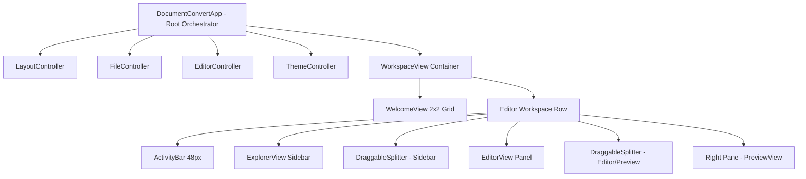

# Studio Workspace & File Explorer Architecture (v1.8.0)

**Date**: 2026-08-27  
**Branch**: `feat/duy-27082026-activity-bar-explorer`  
**Status**: Completed & Verified  

---

## 1. Overview & Objectives

Bản nâng cấp **Studio Workspace v1.8.0** chuyển đổi toàn diện giao diện từ mô hình công cụ đơn lẻ sang **Studio IDE chuyên nghiệp**, tích hợp cây thư mục dự án (File Explorer), thanh tác vụ Activity Bar, thanh kéo chia tỉ lệ linh hoạt (Draggable Splitter) và làm mới giao diện chào mừng (Welcome Screen).

### Mục tiêu chính:
1. **Activity Bar**: Thanh điều hướng thanh dọc chuẩn IDE (chuyển đổi tab Explorer, Tìm kiếm, YouTube Companion, Settings).
2. **File Explorer**: Duyệt cây thư mục dự án đệ quy, nhận diện icon theo định dạng tệp, mở file trực tiếp vào Editor và Live Preview.
3. **Draggable Splitter (60fps)**: Thanh kéo chia tỉ lệ giữa Sidebar/Workspace và giữa Editor/Live Preview, tự động lưu tỉ lệ và khôi phục khi khởi động.
4. **Welcome Screen 2x2 Grid**: Thiết kế lại giao diện chào mừng với 4 thẻ tác vụ chính, phím tắt vật lý `<kbd>`, tương thích hoàn hảo Light & Dark Mode.
5. **Pure Orchestrator MVC Architecture**: Đảm bảo luồng điều phối dữ liệu sạch sẽ, không có hàm trùng đè, đạt 100% độ phủ kiểm thử.

---

## 2. Architecture & Components



### Chi tiết các module mới & cải tiến:

### 2.1. `ActivityBar` (`src/ui_flet/layout/activity_bar.py`)
- Kích thước chuẩn: `width=48` (khi ở bên trái) hoặc `height=48` (khi chuyển vị trí).
- Các icon tương tác: Explorer (`FOLDER`), Search (`SEARCH`), YouTube Companion (`PLAY_CIRCLE`), Settings (`SETTINGS`).
- Trạng thái Active Highlight: Viền chỉ thị màu chủ đề `accent_primary` cho tab đang hoạt động.
- Hỗ trợ đổi vị trí linh hoạt (Left/Right) qua thiết lập `state.sidebar_position`.

### 2.2. `ExplorerView` (`src/ui_flet/views/explorer_view.py`)
- Tự động quét và hiển thị cấu trúc cây thư mục đệ quy.
- **Inline File Filter**: Ô tìm kiếm nhanh ngay dưới tiêu đề `FILE EXPLORER`, tự động lọc và hiển thị danh sách các file khớp từ khóa theo thời gian thực kèm đường dẫn tương đối `[rel_path]`.
- Nhận diện icon và màu sắc theo đuôi file (`.md`, `.docx`, `.xlsx`, `.pdf`, `.csv`, `.html`, `.pptx`, `.json`, `.yaml`, `.py`, `.js`, `.css`).
- Tương tác mở file: Click hoặc Double-Click để nạp ngay nội dung vào `EditorView` và tự động phân tích định dạng sang `Live Preview`.
- Tích hợp các nút thao tác nhanh: *Open Folder*, *Collapse All*, *Refresh Tree*.

### 2.3. `QuickOpenDialog` (`src/ui_flet/components/quick_open_dialog.py`)
- Modal Dialog mở nhanh file theo phong cách VS Code / Obsidian.
- Kích hoạt qua nút **Search** trên Activity Bar hoặc phím tắt **`Ctrl + P`**.
- Hỗ trợ duyệt nhanh toàn bộ file trong Workspace, tìm kiếm mờ (fuzzy search), tự động nạp file vào Editor khi nhấn `Enter`.

### 2.4. `DraggableSplitter` (`src/ui_flet/components/draggable_splitter.py`)
- Sử dụng `ft.GestureDetector` bắt sự kiện kéo `on_pan_update` với độ mượt 60fps.
- **Giới hạn an toàn (Safety Bounds)**:
  - Sidebar: `150px` đến `500px` (hoặc tối đa 45% chiều rộng cửa sổ).
  - Editor ↔ Preview: Tỉ lệ `0.20` – `0.80` (đảm bảo không bên nào bị ép quá hẹp vỡ chữ).
- **Phím tắt cử chỉ**: Double-Click/Double-Tap vào thanh kéo để tự động đưa về tỉ lệ cân bằng chuẩn `50:50` (`editor_ratio = 0.5`).
- **Persistence**: Tự động ghi nhớ và lưu cấu hình vào `settings.json` khi kết thúc kéo (`on_pan_end`).

### 2.4. `WelcomeView` (`src/ui_flet/views/welcome_view.py`)
- Tái cấu trúc thành **Lưới 4 thẻ hành động 2x2**:
  1. *Open Document* (`Ctrl + O`): Nạp file Markdown, Word, Excel, PDF, CSV...
  2. *Open Project Folder* (`Ctrl + B`): Quản lý tệp trong cây thư mục File Explorer.
  3. *New Blank Note*: Soạn thảo Markdown với Live Preview tức thì.
  4. *YouTube Companion*: Trích xuất phụ đề song ngữ tự động.
- **Shortcut Badge `<kbd>`**: Thiết kế mô phỏng phím bấm vật lý, chữ tự động chuyển Trắng (Dark Mode) / Đen (Light Mode), viền `1px` màu chủ đề `accent_primary`.
- **Icon Badge**: Kích thước hình vuông chuẩn `48x48`, bo góc `border_radius=12`.

---

## 3. Refinements, Bug Fixes & Technical Decisions

Trong quá trình hoàn thiện nhánh tính năng này, các vấn đề kỹ thuật chuyên sâu sau đã được phân tích và xử lý triệt để:

### 3.1. Luồng Khởi động & Mở Thư mục Thông minh
- **Vấn đề**: Khi khởi động ứng dụng đã có `workspace_folder` từ trước nhưng vẫn bị hiển thị màn hình Welcome View.
- **Khắc phục**: Cập nhật logic phân luồng khởi động trong `app.py`:
  - *Ưu tiên 1*: Có bản nháp `draft_autosave.md` ➔ Nạp bản nháp và vào Editor.
  - *Ưu tiên 2*: Có `workspace_folder` hợp lệ ➔ Mở thẳng vào `editor_workspace` (Explorer nạp cây thư mục, Editor sẵn sàng).
  - *Ưu tiên 3*: Workspace hoàn toàn trống ➔ Hiển thị `WelcomeView`.

### 3.2. Khắc phục Lỗi Giật Tỉ lệ Kéo (Splitter Jump on Click)
- **Nguyên nhân**: Sự tồn tại của một phương thức trùng tên `apply_panel_visibility` ở cuối `layout_controller.py` đã ghi đè ngầm lên phương thức gốc, làm mất lệnh gọi `apply_editor_ratio()` khi khởi động. Khiến màn hình hiển thị tỉ lệ `50:50` nhưng RAM lưu `70:30`, dẫn đến cú giật mạnh khi click vào thanh kéo.
- **Khắc phục**: Dọn dẹp hàm trùng lặp, đảm bảo `apply_editor_ratio()` luôn chạy ngay trong pha `load_and_apply()` khi mở app.

### 3.3. Tối ưu Chiều cao Khung Soạn thảo & Loại bỏ Code Di sản
- **Phân tích kỹ thuật Flutter**: `TextField(multiline=True)` trong Flutter Engine hoạt động theo cơ chế co giãn nội dung (Content-Driven Auto-Grow). Khi chưa đủ dòng chữ, nó duy trì chiều cao theo `min_lines`.
- **Khắc phục**: 
  - Thiết lập `min_lines=24` cố định giúp khung soạn thảo nở to vừa vặn toàn bộ không gian làm việc ban đầu.
  - Xóa bỏ hoàn toàn hàm di sản `update_editor_dynamic_height()` và các công thức tính toán dòng thủ công cũ (`lines = 20 + 4 + 3...`), giúp code sạch sẽ và chuẩn Clean Code.

---

## 4. Static AST & Locale Audit Results

Đã thực hiện script phân tích tĩnh tự động trên toàn bộ codebase:
- **AST Duplicate Check**: `0 duplicate functions/methods found in codebase`.
- **i18n Locale Parity**: `100% key parity between vi.json and en.json` (0 khóa trùng lặp, 0 khóa bị thiếu).

---

## 5. Verification & Test Suite

Toàn bộ 94 kịch bản kiểm thử tự động (Unit Tests & Smoke Tests) đã vượt qua:

```powershell
python -m unittest discover tests
----------------------------------------------------------------------
Ran 94 tests in 8.550s

OK
```

### Danh sách các Module Kiểm thử Trọng tâm:
- `tests/test_draggable_splitter.py`: Kiểm thử cử chỉ kéo, tính toán tỉ lệ flex, giới hạn biên và double-tap reset.
- `tests/test_smoke_imports.py`: Kiểm thử khởi tạo `ExplorerView`, `ActivityBar`, `WelcomeView` callbacks và i18n localization.
- `tests/test_headless_launch.py`: Kiểm thử vòng đời khởi động ứng dụng headless và nạp cấu hình settings an toàn.
