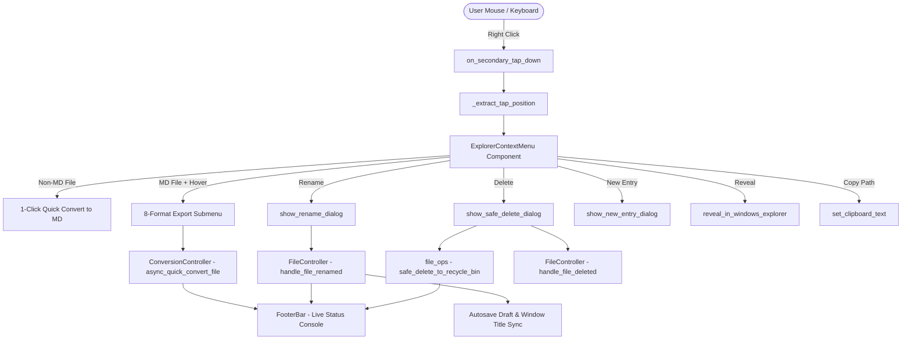

# Explorer Context Menu & Safe File Operations (v1.8.1a)

**Date**: 2026-08-28  
**Branch**: `feat/duy-28082026-explorer-context-menu`  
**Status**: Completed & Verified (102/102 tests passed)  

---

## 1. Overview & Objectives

Bản nâng cấp **Pha 1.8.1a (Explorer Context Menu & Safe File Operations)** hoàn thiện hệ thống quản trị tệp tin trực tiếp trên cây thư mục **File Explorer** của Studio Workspace. Giúp người dùng thực hiện các thao tác tệp tin hàng ngày (đổi tên, xóa an toàn, tạo tệp/thư mục mới, chuyển đổi nhanh, sao chép đường dẫn, mở trong Windows Explorer) một cách trực quan, mượt mà và an toàn tuyệt đối với dữ liệu người dùng.

### Mục tiêu chính:
1. **Safe File Operations Module**: Tích hợp Win32 Shell API đưa file vào Thùng rác (Recycle Bin), kiểm tra chống đặt tên trùng ký tự cấm và Windows Reserved Device Names.
2. **Explorer Context Menu Component**: Menu chuột phải nổi phong cách IDE hiện đại, hỗ trợ click-outside backdrop dismissal và menu phân cấp (Submenu) thông minh.
3. **Smart 2-Tier Quick Convert**: Chuyển đổi 1-click sang `.md` cho tệp thường và flyout submenu 8 định dạng xuất cho tệp Markdown (`.md`).
4. **File Operation Modals**: Hộp thoại đổi tên, xác nhận xóa cảnh báo file chưa lưu (`is_dirty`), và tạo mới tệp/thư mục chuẩn i18n 100%.
5. **Explorer View & Footer Bar Integrations**: Thêm nút *Thu gọn tất cả* (`Collapse All Folders`), menu 3 chấm Popup khi Sidebar co hẹp (< 210px), hiệu ứng Hover Highlight từng dòng tệp/thư mục, tự động bỏ chọn khi Clear Editor, và phản hồi trạng thái tức thì lên Footer Console.

---

## 2. Architecture & Core Components



---

## 3. Chi tiết các Module & Tính năng Đã Xây Dựng

### 3.1. Safe File Operations (`src/utils/file_ops.py`)
- **`safe_delete_to_recycle_bin(path)`**:
  - Gọi Win32 `SHFileOperationW` thông qua `ctypes`.
  - Chuẩn hóa chuỗi Unicode kết thúc bằng 2 ký tự null (`\0\0`) qua `ctypes.create_unicode_buffer(f"{abs_path}\0")`.
  - Cờ thiết lập: `FO_DELETE | FOF_ALLOWUNDO | FOF_SILENT | FOF_NOCONFIRMATION`.
  - Kiểm tra cả mã trả về `res == 0` và `fAnyOperationsAborted == False` $\rightarrow$ Đảm bảo tệp luôn vào Thùng rác và không bao giờ silent-fail.
- **`sanitize_filename(name)`**:
  - Chặn độ dài quá 255 ký tự, khoảng trắng/dấu chấm ở đầu hoặc cuối.
  - Chặn 9 ký tự cấm của Windows: `\ / : * ? " < > |`.
  - Chặn toàn bộ **Windows Reserved Device Names**: `CON`, `PRN`, `AUX`, `NUL`, `COM1-9`, `LPT1-9` (kể cả khi có phần mở rộng như `CON.md`, `aux.txt`).
- **`reveal_in_windows_explorer(path)`**:
  - Thực thi `subprocess.Popen(["explorer.exe", f"/select,{norm_path}"], shell=False)` an toàn với đường dẫn chứa khoảng trắng và tiếng Việt có dấu.

### 3.2. Floating Context Menu Component (`src/ui_flet/components/context_menu.py`)
- **Định vị & Backdrop Dismiss**:
  - Định vị chính xác theo tọa độ `(pos_x, pos_y)` và tự động giới hạn (boundary clamping `width=230px`) để menu không bị tràn ra ngoài màn hình.
  - Bọc toàn màn hình bằng `GestureDetector` tàng hình, click chuột trái/phải ra ngoài tự động đóng menu mượt mà.
  - Thiết lập `no_wrap=True, max_lines=1, overflow=ft.TextOverflow.ELLIPSIS` $\rightarrow$ Đảm bảo tất cả tiêu đề trong menu và submenu luôn nằm trên 1 dòng duy nhất, không bao giờ rớt dòng.
- **Smart 2-Tier Quick Convert**:
  - **Tệp không phải Markdown** (`.docx`, `.pdf`, `.pptx`, `.xlsx`, `.html`, `.json`, `.yaml`...): Hiển thị duy nhất 1 action `⚡ Chuyển sang Markdown (.md)` (`t("explorer.quick_convert_to_md")`).
  - **Tệp Markdown** (`.md`): Hiển thị `🚀 Chuyển đổi sang... ▶`. Khi di chuột vào (hover), Submenu cấp 2 tự động bung ra bên cạnh với đầy đủ **8 định dạng xuất**:
    - 📄 Word (`.docx`)
    - 📑 PDF (`.pdf`)
    - 📽️ PowerPoint (`.pptx`)
    - 🌐 HTML (`.html`)
    - 📊 Excel (`.xlsx`)
    - 📋 CSV (`.csv`)
    - 🏷️ JSON (`.json`)
    - ⚙️ YAML (`.yaml`)
- **Cơ chế Hover Native (`GestureDetector`)**:
  - Bắt sự kiện `on_enter` / `on_exit` trực tiếp từ Flutter pointer region, tự động mở submenu khi rê chuột vào và tự động thu lại khi rê sang mục khác.
  - Tự động lật sang bên trái nếu menu nằm sát mép phải màn hình.

### 3.3. File Operation Modals (`src/ui_flet/components/file_modals.py`)
- **`show_rename_dialog`**:
  - Đổi tên tệp hoặc thư mục với `autofocus`, validate tức thì lỗi ký tự cấm và tệp trùng tên.
  - Hỗ trợ phím `Enter` để lưu và `Esc` để hủy.
- **`show_safe_delete_dialog`**:
  - Hộp thoại màu đỏ cảnh báo chuyển vào Thùng rác Windows.
  - Cảnh báo riêng bằng màu vàng cam nếu tệp đang mở có thay đổi chưa lưu (`is_dirty=True`).
- **`show_new_entry_dialog`**:
  - Hộp thoại tạo nhanh tệp Markdown (`.md`) hoặc tạo thư mục mới.
- **Chuẩn hóa vòng đời Modal**: Cấu hình `modal=False` kèm `dlg.open = False` và `page.update()` $\rightarrow$ Hỗ trợ click ra ngoài vùng mờ (backdrop) để tắt modal.

### 3.4. Cải tiến Explorer View & Footer Bar (`explorer_view.py`, `footer_bar.py`, `layout_controller.py`)
- **Responsive Header & Nút Thu gọn tất cả (`Collapse All Folders`)**:
  - Khi Sidebar $\ge 210\text{ px}$: Hiện đầy đủ 3 nút thao tác nhanh: *Collapse All* (`ft.Icons.UNFOLD_LESS_ROUNDED`), *Open Folder* (`ft.Icons.FOLDER_OPEN_ROUNDED`), *Refresh Tree* (`ft.Icons.REFRESH_ROUNDED`).
  - Khi Sidebar $< 210\text{ px}$: Tự động thu gọn thành **nút 3 chấm (`ft.Icons.MORE_HORIZ_ROUNDED`)** mở ra Dropdown Menu nổi dạng card bo góc đồng bộ phong cách Context Menu.
- **Hover Highlight từng dòng**:
  - Rê chuột qua bất kỳ tệp hoặc thư mục nào sẽ sáng nhẹ nền (`ft.Colors.with_opacity(0.06, ft.Colors.ON_SURFACE)`), mang lại phản hồi thị giác chuẩn VS Code.
- **Tự động Deselect khi Clear Editor**:
  - Bấm nút *Clear Editor* trên Ribbon Bar sẽ reset trạng thái active path và gọi `explorer_view.set_active_file("")` để bỏ chọn hoàn toàn highlight trên cây Explorer.
- **Đồng bộ Footer Bar Status Console**:
  - Mọi thao tác Quick Convert, Rename, Safe Delete, New Entry, Copy Path đều phát thông điệp trạng thái và màu sắc tương ứng lên Footer Bar.

---

## 4. Các Vấn đề Kỹ thuật Đã Giải Quyết (Bug Fixes & Edge Cases)

| Vấn đề phát sinh | Nguyên nhân gốc | Giải pháp khắc phục |
|---|---|---|
| `AttributeError: 'TapEvent' object has no attribute 'global_x'` | Flet phiên bản mới lưu tọa độ trong `e.global_position.x` (Offset) thay vì thuộc tính phẳng `global_x` | Tạo hàm `_extract_tap_position(e)` với cơ chế fallback 4 tầng (`global_position` $\rightarrow$ `local_position` $\rightarrow$ `e.data` JSON $\rightarrow$ default) |
| Nút bấm modal (*Cancel*, *Move to Trash*) không phản hồi | `page.overlay.remove(dlg)` chạy trước khi `dlg.open = False` làm mất control tree của Python | Chuẩn hóa theo kiến trúc `AlertDialog` repository (`dlg.open = False`, `page.update()`) |
| Định dạng PowerPoint (`.pptx`) bị thiếu | Chưa khai báo `.pptx` trong `EXT_CONFIG` và danh sách chuyển đổi Quick Convert | Bổ sung icon `SLIDESHOW_ROUNDED`, màu cam chuẩn PPTX, hỗ trợ Quick Convert 2 chiều PPTX ↔ MD |
| Submenu Hover không kích hoạt trên Desktop | `on_hover` trên `ft.Container` có `ink=True` bị InkWell của Flutter nuốt pointer event | Bọc nội dung bằng `ft.GestureDetector(on_enter=..., on_exit=...)` bắt native pointer events |
| Đổi tên file đang mở làm sai lệch Draft Autosave | `draft_autosave_meta.json` lưu đường dẫn cũ, timer autosave ghi đè sai | `handle_file_renamed` tự động cập nhật `state.in_path`, `state.out_path`, window title và gọi ngay `perform_autosave()` |
| Nhãn menu bị rớt dòng khi dài | Menu width cố định 220px và Text chưa set `no_wrap=True` | Tăng `_menu_width = 230px`, chuẩn hóa nhãn `Collapse All Folders` / `Thu gọn tất cả`, thêm `no_wrap=True, overflow=ellipsis` |

---

## 5. Kết quả Kiểm thử & Xác minh Chất lượng (Verification)

### 🧪 Automated Unit Tests:
- **`tests/test_file_ops.py`**: **6/6 tests Passed**
  - `test_sanitize_filename_valid`: Kiểm tra tên hợp lệ tiếng Việt, khoảng trắng giữa, số.
  - `test_sanitize_filename_invalid_chars`: Kiểm tra chặn 9 ký tự cấm Windows.
  - `test_sanitize_filename_reserved_names`: Kiểm tra chặn toàn bộ Windows Reserved Names (`CON`, `PRN`, `AUX`, `NUL`, `COM1-9`, `LPT1-9`, `con.md`).
  - `test_sanitize_filename_whitespace_and_dots`: Kiểm tra khoảng trắng/chấm đầu cuối.
  - `test_safe_delete_to_recycle_bin`: Tạo file tạm và thư mục tạm, xác minh xóa an toàn vào Thùng rác.
  - `test_reveal_in_windows_explorer`: Kiểm tra lệnh mở Explorer an toàn không crash.
- **Toàn bộ Test Suite Dự án (`python -m unittest discover tests`)**:
  - **102 / 102 tests Passed** (`Ran 102 tests in 9.244s — OK`).
  - 0 failures, 0 errors.

---

## 6. Files Changed & Added

```text
src/
├── utils/
│   └── file_ops.py                                     [NEW]  - Safe Win32 file operations & validation
├── ui_flet/
│   ├── components/
│   │   ├── context_menu.py                             [NEW]  - Floating right-click menu, hover flyouts & header dropdown
│   │   └── file_modals.py                              [NEW]  - Rename, Safe Delete, and New File/Folder modals
│   ├── views/
│   │   └── explorer_view.py                            [MOD]  - Secondary gestures, hover highlight, collapse all, responsive header
│   ├── controllers/
│   │   ├── file_controller.py                          [MOD]  - Active file rename/delete & draft metadata sync
│   │   ├── conversion_controller.py                    [MOD]  - Async quick convert from right-click
│   │   ├── editor_controller.py                        [MOD]  - Deselect explorer on clear editor
│   │   └── layout_controller.py                        [MOD]  - Responsive header sync on sidebar drag
│   ├── layout/
│   │   └── footer_bar.py                               [MOD]  - Status console updates
│   └── app.py                                          [MOD]  - Pure Orchestrator callback wiring
├── i18n/
│   └── locales/
│       ├── vi.json                                     [MOD]  - Added 25+ localization keys for Explorer menu & modals
│       └── en.json                                     [MOD]  - Added 25+ localization keys for Explorer menu & modals
tests/
└── test_file_ops.py                                    [NEW]  - Unit test suite for safe file operations
docs/
├── roadmaps/
│   └── product_roadmap.md                              [MOD]  - Updated Phase 1.8.1a/1.8.1b/1.8.1c roadmap
└── archive/
    └── 20260828_explorer_context_menu_and_safe_file_operations.md [NEW] - This document
```
