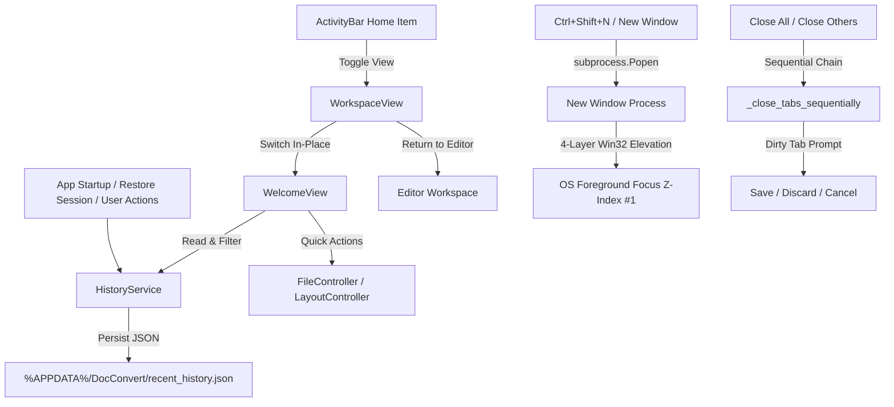

# Báo Cáo Kỹ Thuật: Recent History, Welcome Dashboard & Multi-Process Window Focus (v1.9.2)

**Ngày hoàn thành**: 04/09/2026  
**Phiên bản phát hành**: `v1.9.2`  
**Nhánh thực hiện**: `feat/duy-04092026-recent-history-welcome`  

---

## 1. Tổng Quan Mục Tiêu (Executive Summary)

Phiên bản `v1.9.2` tập trung nâng cấp trải nghiệm người dùng trên màn hình **Welcome Dashboard** và quản lý lịch sử tệp / thư mục dự án gần đây (**Recent History**), giải quyết các bài toán về:
1. **Quản lý lịch sử gần đây tập trung (HistoryService)**: Lưu trữ bền vững, sắp xếp LRU, ghim (pin/unpin), tìm kiếm nhanh và xác thực sự tồn tại của tệp trên đĩa.
2. **Tái thiết kế giao diện Welcome Dashboard**: Giao diện 2 cột thích ứng (`Quick Actions` + `Recent Documents & Folders`), căn chỉnh chiều ngang 100% tràn viền khớp hoàn hảo với thanh Ribbon và thanh Footer.
3. **Điều hướng linh hoạt & 2 chiều**: Tích hợp icon Home trên Activity Bar với cơ chế Toggle 2 chiều, nút "Quay lại soạn thảo" (Back to Editor), và nút Đóng Thư mục (Close Workspace).
4. **Cơ chế Cửa sổ mới (New Window) với 4-Layer Win32 Focus Elevation**: Hỗ trợ phím tắt `Ctrl + Shift + N` mở instance OS độc lập, tự động nâng quyền ưu tiên Z-index #1 và cướp focus bàn phím ngay tức thì.
5. **Đóng tab hàng loạt tuần tự (Sequential Confirmation Chain)**: Giải quyết triệt để lỗi mất tương tác khi gọi `Close All` / `Close Others` / `Close to Right` trên các tab chưa lưu (dirty).

---

## 2. Kiến Trúc Kỹ Thuật & Các Module Cốt Lõi

### 2.1. `HistoryService` (`src/services/history_service.py`)
- **Singleton Pattern & Thread Safety**: Đảm bảo toàn bộ ứng dụng chỉ sử dụng duy nhất một instance với `threading.Lock()` bảo vệ mọi thao tác đọc/ghi.
- **Lưu trữ bền vững**: Ghi dữ liệu ra `%APPDATA%/DocConvert/recent_history.json`.
- **Cơ chế LRU & Pinning**:
  - Giới hạn tối đa 20 files và 10 folders.
  - Các mục được Ghim (Pinned) luôn ưu tiên nằm ở đầu danh sách, sắp xếp theo thời gian mở gần nhất.
  - Các mục không ghim xếp bên dưới theo thứ tự LRU (Most Recently Used).
- **Tìm kiếm & Xác thực**: Hàm `get_items(filter_type, query)` lọc theo danh mục (`all`, `files`, `folders`), tìm kiếm mờ theo tên/đường dẫn, và gắn cờ `exists: bool` kiểm tra tồn tại thực tế trên ổ cứng.

### 2.2. Tái thiết kế `WelcomeView` (`src/ui_flet/views/welcome_view.py`)
- **Bố cục 2 cột thích ứng**:
  - Cột trái: Logo branding, 5 thẻ Quick Action (Mở tài liệu `Ctrl+O`, Mở thư mục `Ctrl+B`, Ghi chú mới `Ctrl+T`, YouTube Companion, Chuyển đổi âm thanh) cùng hàng nút tiện ích (Model Hub, Trợ giúp, Cửa sổ mới, Quay lại soạn thảo).
  - Cột phải: Khung tìm kiếm, bộ lọc danh mục (`Tất cả` / `Tệp` / `Thư mục`), nút Xóa lịch sử, danh sách cuộn mượt các thẻ `RecentItemTile`.
- **Thẻ `RecentItemTile`**: Hiển thị icon định dạng màu sắc (PDF đỏ, Word xanh, Markdown xanh lá, Audio cam, Video tím, Folder vàng), đường dẫn phụ, nhãn cảnh báo nếu file bị xóa ngoài Explorer, relative timestamp (*Vừa xong, 10m ago...*), nút Ghim và nút Xóa.
- **Căn lề chuẩn mực**: Loại bỏ padding thừa ở 2 bên (`padding=ft.Padding(left=0, top=4, right=0, bottom=4)`), mở rộng card chiếm trọn chiều ngang, thẳng hàng với Ribbon Bar và Footer Bar.

### 2.3. Điều hướng & Đồng bộ Tự động (`app.py`, `workspace_view.py`)
- **Tự động đồng bộ Lịch sử**:
  - Khi nạp session nháp lúc khởi động (`async_load_draft_if_exists`).
  - Khi người dùng bấm icon **Home** trên Activity Bar.
  - Khi mở file/thư mục qua Explorer hoặc hộp thoại lưu.
- **Home Toggle 2 chiều**: Nếu người dùng đang ở Welcome Dashboard và còn tab mở, bấm lại nút Home sẽ lập tức quay trở lại Editor.
- **Nút Đóng Workspace (`Close Folder`)**: Tích hợp icon trực tiếp trên tiêu đề Explorer và menu con `...` khi co nhỏ sidebar (`< 260px`).

### 2.4. 4-Layer Win32 Focus Elevation (`src/utils/env.py`, `app.py`)
Giải quyết giới hạn `ForegroundLockTimeout` của hệ điều hành Windows khi spawn tiến trình mới (`Ctrl + Shift + N` / New Window):
1. **Layer 1 (Simulated ALT Key Tap)**: Phát xung phím ảo `keybd_event(VK_MENU)` để mở khóa quyền chiếm Foreground trên Windows.
2. **Layer 2 (Explicit Privilege)**: Gọi `AllowSetForegroundWindow(target_pid)` và `AllowSetForegroundWindow(-1)`.
3. **Layer 3 (Thread Input Attaching & Z-Order #1)**: Kết nối luồng nhập liệu `AttachThreadInput` giữa tiến trình hiện tại và cửa sổ con, gọi `SetWindowPos(hwnd, HWND_TOP, ...)` + `BringWindowToTop(hwnd)` + `SetForegroundWindow(hwnd)` + `SetFocus(hwnd)`.
4. **Layer 4 (Delayed Re-assertion Safety Net)**: Bổ sung 2 mốc kiểm tra sau 150ms và 400ms để tái xác lập focus nếu Flet UI render trễ.

### 2.5. Đóng Tab Tuần Tự (`src/ui_flet/controllers/layout_controller.py`)
- Xây dựng hàm `_close_tabs_sequentially(tab_ids: list[str])`.
- Các tab sạch được đóng ngay tức thì.
- Đối với tab dirty, tự động chuyển view sang tab đó và hiển thị modal xác nhận (`Save` / `Discard` / `Cancel`).
- Khi người dùng xác nhận `Save` hoặc `Discard`, chuỗi đóng tiếp tục chạy cho các tab còn lại. Nếu bấm `Cancel`, toàn bộ tiến trình dừng lại để bảo toàn dữ liệu.

---

## 3. Danh Mục Tệp Thay Đổi (File Breakdown)

| Tệp tin | Tác vụ | Mô tả chi tiết |
|---|---|---|
| `src/__version__.py` | Sửa | Nâng version lên `1.9.2` |
| `src/services/history_service.py` | Tạo mới | Core History Service quản lý gần đây, LRU, Pinning |
| `tests/test_history_service.py` | Tạo mới | Unit tests cho HistoryService (7 test cases) |
| `src/ui_flet/views/welcome_view.py` | Sửa | Giao diện Welcome 2 cột, Recent tiles, Back to Editor |
| `src/ui_flet/views/workspace_view.py` | Sửa | Điều phối chuyển view Welcome/Editor, nạp history |
| `src/ui_flet/views/explorer_view.py` | Sửa | Tích hợp nút Đóng thư mục, chỉnh ngưỡng compact 260px |
| `src/ui_flet/components/context_menu.py` | Sửa | Bổ sung Đóng thư mục vào menu con Header `...` |
| `src/ui_flet/controllers/file_controller.py` | Sửa | Auto sync restored tabs & workspace vào HistoryService |
| `src/ui_flet/controllers/layout_controller.py` | Sửa | `_close_tabs_sequentially` cho Close All/Others |
| `src/ui_flet/helpers/shortcut_manager.py` | Sửa | Đăng ký phím tắt `Ctrl + Shift + N` cho New Window |
| `src/ui_flet/layout/activity_bar.py` | Sửa | Thêm Home item trên Activity Bar |
| `src/utils/env.py` | Sửa | Thêm hàm `force_process_window_foreground` Win32 |
| `src/ui_flet/app.py` | Sửa | Hook New Window, Home toggle, async focus elevation |
| `src/i18n/locales/en.json` & `vi.json` | Sửa | Đầy đủ bản dịch cho Recent, Home, Close Workspace, New Window |
| `docs/roadmaps/product_roadmap.md` | Sửa | Đánh dấu hoàn thành milestone v1.9.2 |
| `docs/backlog/PERF_002_whisper_download_listener_weakref.md` | Sửa | Bổ sung kịch bản và phân tích kỹ thuật |

---

## 4. Kiểm Thử & Nghiệm Thu (Verification)

1. **Unit Test Suite**:
   - Chạy toàn bộ 204 unit tests: `Ran 204 tests in 10.612s — OK`.
   - `test_history_service.py`: 7/7 tests pass (thêm, xóa, ghim, LRU eviction, tìm kiếm, lưu/nạp đĩa).
2. **Kiểm thử Giao diện & Luồng nghiệp vụ**:
   - Mở app: Welcome Dashboard tràn đều chiều ngang 100%.
   - Mở file / workspace: Danh sách Recent lập tức ghi nhận và hiển thị đầy đủ icon, timestamp.
   - Nhấn `Ctrl + Shift + N`: Cửa sổ mới xuất hiện ngay trên Z-index #1 và nhận focus sẵn sàng gõ.
   - Nhấn Home $\rightarrow$ `Ctrl + T`: Mở thêm tab mới và quay về Editor mà không mất tab cũ hay thư mục.
   - Mở 2+ tabs dirty và bấm `Close All`: Modal xác nhận xuất hiện tuần tự cho từng file, bấm Discard/Save chuyển tiếp mượt mà, bấm Cancel ngắt tiến trình an toàn.
