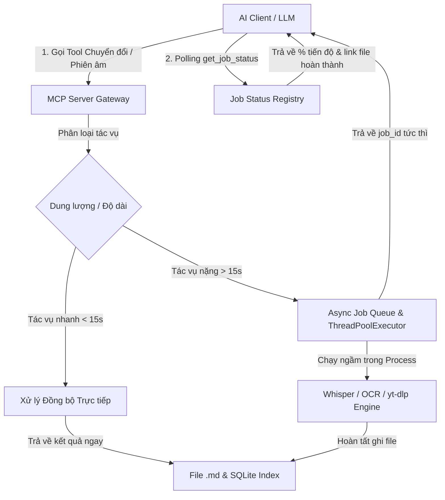

# 🎙️ FEAT-002: MCP Multimodal Importers, Audio/YouTube Transcription & Async Job Pipeline

**Mã Task**: `FEAT-002`  
**Phân loại**: Feature / Multimodal / Long-Running Task Engine  
**Độ ưu tiên**: High  
**Trạng thái**: 🟡 Backlog / Planned  
**Tài liệu liên quan**: [FEAT-001](FEAT_001_mcp_document_version_history_and_safe_patch.md), [SEC-001](SEC_001_mcp_security_boundary_and_stream_hardening.md), [SEC-003](SEC_003_mcp_workspace_session_isolation_and_fail_closed.md)

---

## 1. Hiện trạng & Phân tích Khoảng cách Tính năng (Feature Gap Analysis)

Ứng dụng Desktop **Document Converter** hiện đã sở hữu một hệ sinh thái bóc tách và chuyển đổi dữ liệu đa phương thức rất mạnh mẽ (nằm trong `src/modules/` và `src/services/`):
1. **Bóc tách tài liệu thô sang Markdown**:
   - `WordModule`: Bóc tách cấu trúc `.docx` (Headings, Tables, Lists).
   - `PDFModule`: Tích hợp PyMuPDF, pdfplumber trích xuất bảng biểu, và Tesseract OCR nhận diện ảnh scan.
   - `ExcelModule` & `CSVModule`: Bóc tách dữ liệu dạng bảng sang Markdown Table.
   - `HTMLModule`: Làm sạch trang web, trích xuất cấu trúc văn bản.
2. **Nhận diện giọng nói AI (Speech-to-Text)**:
   - `WhisperAudioModule`: Nhận diện file âm thanh cục bộ (`.mp3`, `.wav`, `.m4a`) sử dụng mô hình Whisper (`faster-whisper` / `ctranslate2`).
3. **Thu thập tài nguyên trực tuyến (Online Media Importers)**:
   - `youtube_dialog.py`: Tải phụ đề tự động hoặc tải audio stream qua `yt-dlp` và phiên âm thành ghi chú Markdown.
   - Google Drive Audio Importer.

### Điểm nghẽn trên giao diện MCP Server hiện tại:
* MCP Server (`docconvert`) hiện chỉ hỗ trợ chiều **Xuất (Export)** từ tài liệu Markdown trong kho tri thức ra các định dạng khác (`MD -> PDF/DOCX/XLSX...`) qua tool `convert_document`.
* **Chưa có công cụ MCP** để AI Agent nhận một file thô ngoài ổ đĩa (`.pdf`, `.docx`, `.mp3`) hoặc đường dẫn URL YouTube và biến thành file Markdown có cấu trúc trong Workspace.

---

## 2. Thách thức Kiến trúc: Tác vụ Nặng & Giới hạn Timeout của AI Client

Các tác vụ chuyển đổi đa phương thức (nhất là file Audio dài 30–60 phút hoặc PDF scan hàng trăm trang) thường mất từ vài chục giây đến vài phút:
* **Vấn đề Timeout**: Đa số các AI MCP Client (như Claude Desktop, Cursor, Antigravity) thiết lập giới hạn timeout cứng cho một lượt gọi Tool (thường là 60s – 120s). Nếu MCP Server chạy đồng bộ (synchronous) chặn luồng quá lâu, client sẽ ngắt kết nối và báo lỗi `Tool call timeout`.
* **Yêu cầu Kiến trúc**: Cần cơ chế chạy nền 100% không giao diện (**Headless Background**), kết hợp với mô hình **Async Job Queue** để xử lý các tệp tin nặng mà không bao giờ bị nghẽn kênh giao tiếp JSON-RPC.

---

## 3. Thiết kế Giải pháp Kỹ thuật (Proposed Architecture)

---

### 3.1. Danh sách Công cụ MCP Mới (New Tool Manifest)

#### 1. `import_document_to_markdown`
* **Mô tả**: Đọc và bóc tách tài liệu thô (`.pdf`, `.docx`, `.xlsx`, `.csv`, `.html`) trong workspace thành file Markdown có cấu trúc, tự động lập chỉ mục vào SQLite Index.
* **Tham số**:
  - `source_path` (string, required): Đường dẫn tương đối hoặc tuyệt đối của file trong workspace.
  - `enable_ocr` (boolean, default=false): Kích hoạt Tesseract OCR nếu phát hiện trang PDF dạng ảnh scan.
  - `output_filename` (string, optional): Tên file `.md` đầu ra (mặc định lấy theo tên file gốc).

#### 2. `transcribe_audio`
* **Mô tả**: Nhận diện giọng nói từ file âm thanh cục bộ (`.mp3`, `.wav`, `.m4a`, `.aac`) thành văn bản Markdown có gắn nhãn thời gian (timestamps).
* **Tham số**:
  - `audio_path` (string, required): Đường dẫn file âm thanh trong workspace.
  - `model_size` (string, default="whisper-base", enum=["whisper-tiny", "whisper-base", "whisper-small", "whisper-medium"]): Lựa chọn mô hình AI phù hợp với cấu hình máy.
  - `language` (string, optional): Mã ngôn ngữ (vd: `"vi"`, `"en"`) hoặc để trống để tự động nhận diện.
  - `async_mode` (boolean, default=true): Chạy ngầm trả về `job_id` nếu file dài > 3 phút.

#### 3. `import_youtube_to_markdown`
* **Mô tả**: Tải và trích xuất nội dung từ liên kết YouTube (ưu tiên trích xuất Transcript API chính thức; nếu không có sẽ tự động tải stream âm thanh và phiên âm bằng Whisper).
* **Tham số**:
  - `url` (string, required): Đường dẫn video YouTube.
  - `preferred_language` (string, default="vi"): Ngôn ngữ phụ đề ưu tiên.
  - `output_filename` (string, optional): Tên file `.md` lưu vào workspace.

#### 4. `get_job_status`
* **Mô tả**: Kiểm tra tiến độ (%) và lấy kết quả của các tác vụ chạy ngầm dài hạn (Audio transcription, OCR batch).
* **Tham số**:
  - `job_id` (string, required): Mã định danh công việc trả về từ các lệnh async.

---

## 4. Kế hoạch Triển khai (Implementation Roadmap)

| Giai đoạn | Nội dung công việc | File ảnh hưởng |
|:---|:---|:---|
| **Phase 1: Raw Document Importers** | • Xây dựng handler `import_document_to_markdown` kết nối `src.services.file_loader.load_document`. • Tự động lưu file `.md` và trigger `MetadataIndex.index_document()`. | `src/mcp/tools.py` `src/mcp/security.py` |
| **Phase 2: Headless Audio & YouTube Pipeline** | • Xây dựng handler `transcribe_audio` kết nối `src.modules.audio_module`. • Xây dựng handler `import_youtube_to_markdown` tích hợp `youtube-transcript-api` & `yt-dlp`. | `src/mcp/tools.py` |
| **Phase 3: Async Background Job Manager** | • Xây dựng `JobManager` quản lý trạng thái (`QUEUED`, `PROCESSING`, `COMPLETED`, `FAILED`) bằng `ThreadPoolExecutor`. • Implement tool `get_job_status` và cơ chế tự động dọn dẹp bộ nhớ đệm task cũ sau 24h. | `src/services/job_manager.py` `src/mcp/tools.py` |
| **Phase 4: Automated Testing & Verification** | • Unit tests cho từng module importer qua giao thức MCP JSON-RPC. • Mock Whisper model và YouTube network requests để test độc lập không phụ thuộc GPU/Mạng. • Test kiểm tra giới hạn an toàn Workspace Boundary cho toàn bộ các file đầu vào/đầu ra. | `tests/test_mcp_importers.py` `tests/test_mcp_async_jobs.py` |

---

## 5. Tiêu chí Nghiệm thu (Acceptance Criteria)

1. [ ] AI Agent có thể đọc bất kỳ file `.pdf` hoặc `.docx` nào trong workspace và chuyển thành file `.md` chỉ bằng 1 câu lệnh chat.
2. [ ] File âm thanh `.mp3` được chuyển thành ghi chú Markdown với độ chính xác cao và chạy ngầm 100% không lag giao diện.
3. [ ] Các video YouTube được tự động tóm tắt nội dung và lưu thành văn bản Markdown trong workspace.
4. [ ] Mọi tác vụ dài hạn không bị ngắt kết nối bởi AI Client Timeout nhờ cơ chế Async Job.
5. [ ] 100% file sinh ra đều tuân thủ nghiêm ngặt ranh giới Workspace Security (`SEC-001`, `SEC-003`).
