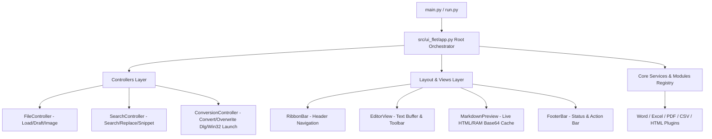
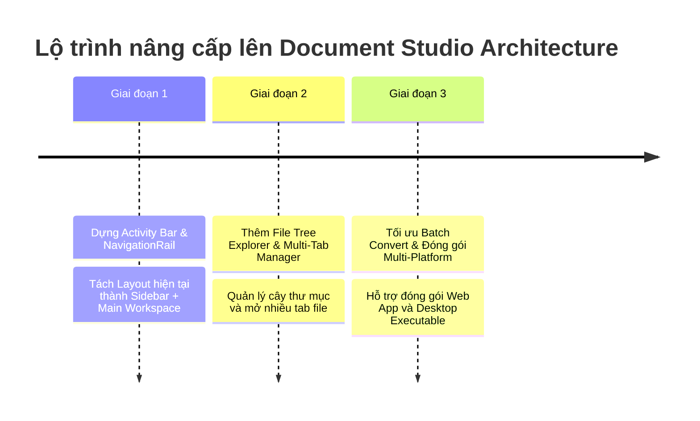

# Document Converter Tool — Architecture Evaluation & Studio Workspace Roadmap

---

## 1. Tổng Quan Ứng Dụng (Executive Summary)

**Document Converter Tool** hiện tại là giải pháp chuyển đổi và biên tập tài liệu đa định dạng (Word, Excel, PDF, CSV, HTML, Markdown) được xây dựng trên nền tảng **Python & Flet Framework (Flutter Engine)**.

Báo cáo này đánh giá toàn bộ kiến trúc hiện tại của ứng dụng và đề xuất lộ trình nâng cấp giao diện từ kiểu **Office Ribbon Bar (Truyền thống)** sang **Document Studio / Workspace Architecture** (Lấy cảm hứng từ VS Code & Obsidian).

---

## 2. Kiểm Toán Tính Năng & Kiến Trúc Hiện Tại (Current System Audit)

### 2.1 Kiến trúc Phần mềm (MVC 3-Tier Architecture)



### 2.2 Các Tính Năng Đang Có Trong App

| Thành phần | Chi tiết Kỹ thuật & Trải nghiệm |
| :--- | :--- |
| **Plugin Registry** | Hệ thống `ModuleRegistry` cho phép đăng ký linh hoạt các định dạng tài liệu (`.docx`, `.xlsx`, `.pdf`, `.csv`, `.html`, `.md`) qua Lazy Import không làm chậm ứng dụng. |
| **Giao diện Ribbon Bar** | 4 Sub-tab Office (`File`, `Edit`, `View`, `Options`) hỗ trợ định dạng Heading (H1-H6), Bold, Italic, Code, Quote, Table, và chèn Ảnh. |
| **Live Markdown Preview** | Xem trước trực tiếp Markdown render HTML song song với RAM Base64 Cache tối ưu hiển thị hình ảnh cục bộ. |
| **Search & Replace Engine** | Hỗ trợ Tìm kiếm/Thay thế Regex, Match Case, nhảy vị trí con trỏ trong Editor và hiển thị danh sách dòng kết quả (L12: snippet...). |
| **Win32 Z-Order Focus** | Cơ chế 3-Layer Win32 (`SPI_SETFOREGROUNDLOCKTIMEOUT` bypass -> `SetWindowPos TOPMOST` toggle -> `FlashWindowEx` fallback) kèm thuật toán ưu tiên `IsIconic` mở Explorer/Word mà không bị co nhỏ cửa sổ. |
| **Theme Engine & Win32 DWM** | 4 Bộ Palette màu sắc (*Violet Cyberpunk*, *Emerald Obsidian*, *Deep Ocean*, *Sunset Gold*) đồng bộ trực tiếp với màu thanh tiêu đề Windows OS (`DwmSetWindowAttribute`). |
| **Autosave Draft System** | Tự động lưu bản nháp sau 2.0s ngưng gõ phím và phục hồi tự động khi mở lại app. |

---

## 3. Định Hướng Phát Triển: Document Studio / Workspace (VS Code & Obsidian Style)

### 3.1 Lý Do Chọn Kiến Trúc Studio Workspace

Giao diện kiểu VS Code / Obsidian giải quyết các hạn chế của thanh Ribbon Bar truyền thống khi ứng dụng phát triển lên quy mô lớn:

1. **Quản lý Thư mục & Nhiều File (Project Workspace)**: Thay vì chỉ mở 1 file đơn lẻ, người dùng có thể mở nguyên một Thư mục dự án (Folder) và chuyển đổi hàng loạt file Markdown/Docx.
2. **Không gian làm việc linh hoạt (Multi-tab System)**: Mở song song nhiều Tab biên tập văn bản, xem trước sơ đồ (Graph/Preview), hoặc bảng dữ liệu CSV.
3. **Mở rộng tiện ích bên Dải dọc (Activity Bar)**: Dễ dàng thêm các tính năng nâng cao (AI Assistant, Export Presets, Bulk Convert) vào dải dọc 48px bên trái mà không làm rối màn hình chính.

### 3.2 So Sánh Mô Hình Giao Diện

| Tiêu chí | Ribbon Bar (Office Style) | Studio Workspace (VS Code / Obsidian Style) |
| :--- | :--- | :--- |
| **Định vị ứng dụng** | Công cụ đổi & sửa 1 file nhanh. | Hệ sinh thái quản lý & biên tập tài liệu đa file (Studio). |
| **Thanh điều hướng** | Ngang phía trên (Header Ribbon). | Dải dọc 48px mép trái (Activity Bar) + Sidebar trượt. |
| **Quản lý file** | Chọn từng file qua File Dialog. | Cây thư mục (File Tree Explorer) + Danh sách file gần đây. |
| **Biên tập đa nhiệm** | 1 File duy nhất trong Editor Buffer. | Đa Tab (Multi-Tab Workspace) + Chia đôi màn hình (Split View). |
| **Ẩn/Hiện linh hoạt** | Thu gọn Ribbon bar qua nút arrow. | Ẩn/Hiện Sidebar bằng phím tắt `Ctrl+B` hoặc click Activity Icon. |

### 3.3 Đánh Giá Tính Tương Thích Đóng Gói Lên Web (Flet Web / WASM)

> [!IMPORTANT]
> **Khả năng tương thích Web: 100% Hoàn hảo & Mượt mà!**
> 
> - **Flet Engine**: Dựa trên Flutter Web Canvas & WASM. Bố cục cột dọc (`NavigationRail`, `VerticalDivider`, `Row`, `Column`) hoạt động linh hoạt và đáp ứng (responsive) trên trình duyệt Web tốt hơn rất nhiều so với thanh Ribbon ngang.
> - **Không phụ thuộc Win32 trên Web**: Các hàm Win32 Focus (`ctypes.windll`) đã được bọc an toàn trong kiểm tra `sys.platform == "win32"`, đảm bảo khi đóng gói Web app sẽ sử dụng cơ chế File Download/Upload chuẩn của trình duyệt mà không bị crash.

---

## 4. Thiết Kế Chi Tiết Giao Diện Studio Workspace Mới

```
+-----------------------------------------------------------------------------------+
|  DocConvert Studio v1.4                                                 _  [square]  X |
+----+-------------------+----------------------------------------------------------+
|    | EXPLORER          | [Baocao.md x] [DuLieu.csv x] [Guide.docx x]               |
| [F]| ----------------- | -------------------------------------------------------- |
|    | > docs/           | # Báo Cáo Doanh Thu Q3                                   |
| [E]|   ├── Baocao.md   |                                                          |
|    |   └── Guide.docx  | Nội dung tài liệu hiển thị tại đây...                     |
| [B]| > data/           |                                                          |
|    |   └── DuLieu.csv  |                                                          |
| [S]|                   |                                                          |
+----+-------------------+----------------------------------------------------------+
| [=]| Ready | UTF-8 | Markdown -> Excel | Words: 1,250 | Chars: 8,400                 |
+----+------------------------------------------------------------------------------+
```

### Các Thành Phần Kiến Trúc Mới:

1. **Activity Bar (Dải biểu tượng dọc 48px - Sử dụng 100% Vector Icons `ft.Icons.*`)**:
   - `ft.Icons.FOLDER_OUTLINED` (**Explorer Icon**): Bật/tắt Sidebar cây thư mục file dự án (`Ctrl+B`).
   - `ft.Icons.EDIT_NOTE_OUTLINED` (**Editor & Converter Icon**): Chế độ tập trung viết văn bản & xem Ribbon công cụ.
   - `ft.Icons.FLASH_ON_ROUNDED` (**Batch Converter Icon**): Giao diện chuyển đổi hàng loạt (Bulk Processing).
   - `ft.Icons.SETTINGS_OUTLINED` (**Settings Icon**): Quản lý Palette màu, Ngôn ngữ, và Chế độ Theme (Light/Dark).
2. **Collapsible Sidebar (Cây thư mục & Quản lý Dự án)**:
   - Hiển thị cấu trúc thư mục, cho phép kéo thả file hoặc click để mở nhanh trong Workspace.
3. **Multi-Tab Workspace (Không gian biên tập Đa Tab)**:
   - Cho phép mở nhiều file cùng lúc, có nút đóng `x`, icon theo định dạng file (`.md`, `.docx`, `.xlsx`, `.pdf`).
4. **Bottom Status Bar (Thanh trạng thái Studio)**:
   - Hiển thị Mode chuyển đổi hiện tại, số từ/ký tự, định dạng mã hóa (UTF-8), và nút **CONVERT NOW**.

---

## 5. Lộ Trình Nâng Cấp Kỹ Thuật (Migration Plan)



### Bước 1: Dựng `ActivityBar` Component (`src/ui_flet/layout/activity_bar.py`)
- Sử dụng `ft.NavigationRail` của Flet để tạo dải biểu tượng chuyển tab dọc bên trái.

### Bước 2: Tích hợp `FileExplorer` Component (`src/ui_flet/views/explorer_view.py`)
- Xây dựng cây thư mục bằng `ft.ListView` kết hợp lồng `ft.ExpansionTile` (hoặc `ft.Column` với indentation phân cấp) hiển thị các file/thư mục làm việc.

### Bước 3: Đưa `EditorView` vào `TabManager` (`src/ui_flet/views/workspace_view.py`)
- Quản lý danh sách Tab đang mở qua `ft.Tabs`, lưu trữ state riêng cho từng file.

---

## 6. Kết Luận & Đề Xuất Bước Tiếp Theo

1. Kiến trúc hiện tại của `DocumentConvertTool` đã được tái cấu trúc thành công theo chuẩn **MVC (Controller decoupled)** nên việc nâng cấp sang mô hình **Studio Workspace** là **hoàn toàn khả thi và không gây đập đi làm lại phần xử lý cốt lõi**.
2. Mô hình Studio Workspace sẽ nâng tầm ứng dụng lên đẳng cấp chuyên nghiệp (tương tự VS Code & Obsidian), rất phù hợp cho người dùng làm việc lâu dài.
3. Nếu bạn sẵn sàng, chúng ta có thể bắt đầu triển khai **Giai đoạn 1: Dựng Activity Bar & Layout Khung Studio** ngay!
