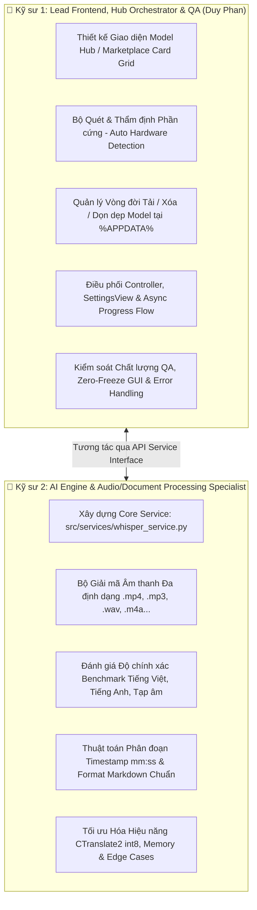
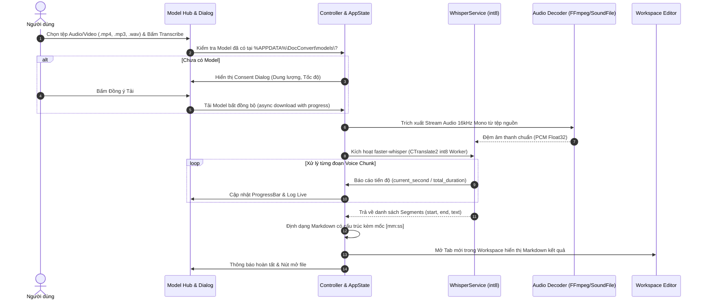

# 🎙️ Audio/Video Transcriber (Whisper AI) & Model Hub Marketplace — Kế Hoạch Kiến Trúc & Phân Công Kỹ Thuật

**Mã định danh**: `FEAT-WHISPER-001`  
**Phiên bản phát hành mục tiêu**: `v1.9.0 (AI-Powered Transcriber & Model Marketplace Release)`  
**Ngày cập nhật**: 29/08/2026  
**Trạng thái**: 🟢 Planning & Architecture Specification  

---

## 1. Tầm nhìn Kiến trúc & Định vị Sản phẩm (Executive Summary & Vision)

Tính năng **Offline Audio/Video Transcriber** không đơn thuần là một nút bấm chuyển đổi tệp, mà là bước chuyển mình quan trọng đưa **Document Converter Tool** tiến vào kỷ nguyên **Local AI / Edge Computing**.

Ứng dụng được thiết kế theo mô hình **AI Model Hub / Model Marketplace**:
1. **Quyền tự chủ của người dùng (User Autonomy)**: Người dùng toàn quyền quyết định tải, trải nghiệm, chuyển đổi hoặc xóa các mô hình AI (`tiny`, `base`, `small`, `PhoWhisper`...) tùy theo nhu cầu độ chính xác và cấu hình phần cứng của máy tính.
2. **Ứng dụng làm Bộ điều phối trung gian (Smart AI Orchestrator)**:
   - Tự động thẩm định phần cứng máy tính (RAM, số nhân CPU, GPU CUDA) để đưa ra khuyến nghị model phù hợp nhất.
   - Quản lý tải xuống, lưu trữ và giải phóng bộ nhớ model cục bộ tại `%APPDATA%\DocConvert\models\`.
   - Phân luồng tác vụ giải mã âm thanh và nhận diện giọng nói chạy nền (Background Worker), tự động xuất ra tài liệu Markdown có cấu trúc kèm mốc thời gian `[mm:ss]` đưa thẳng vào Studio Workspace.
3. **Bộ cài đặt siêu nhẹ (`Setup.exe`)**: Áp dụng chiến lược **Tải Model Theo Nhu Cầu (On-demand Download)**, không bundle file weights nặng hàng trăm MB vào bộ cài đặt ban đầu, giữ file cài đặt luôn gọn nhẹ (< 80MB).

---

## 2. Ma trận Phân công Trách nhiệm Kỹ thuật (2-Person Responsibility Matrix)

Dự án được chia tách thành 2 mảng chuyên môn độc lập để tối đa hóa hiệu suất và chất lượng sản phẩm:



### Chi tiết Phân công Nhiệm vụ:

| Hạng mục | 👤 Kỹ sư 1: Lead Frontend & Orchestrator (Duy Phan) | 👤 Kỹ sư 2: AI & Processing Specialist |
| :--- | :--- | :--- |
| **Giao diện & Trải nghiệm (UI/UX)** | • Thiết kế Marketplace Card Grid (Thẻ model, badge sao ⭐, tốc độ 🚀, RAM).<br>• Thanh trạng thái dung lượng ổ cứng & Modal tải model.<br>• Tích hợp vào `SettingsView` và phím tắt trên `ActivityBar`. | • Tham vấn các thông số kỹ thuật cần hiển thị cho từng model.<br>• Phối hợp thiết kế hiển thị log nhận diện giọng nói thời gian thực. |
| **Động cơ AI & Xử lý Âm thanh** | • Điều phối gọi hàm `whisper_service.transcribe_async()`.<br>• Bắt các sự kiện `on_progress` và cập nhật thanh tiến trình. | • Xây dựng module `src/services/whisper_service.py` (`faster-whisper` + CTranslate2 `int8`).<br>• Giải mã audio từ video `.mp4`, `.mkv` và audio `.mp3`, `.wav`, `.m4a`, `.aac`, `.flac`. |
| **Quản lý Tài nguyên & Phần cứng** | • Viết hàm quét phần cứng (RAM, CPU Cores, GPU CUDA detection).<br>• Gắn nhãn *"Khuyên dùng cho cấu hình của bạn"* trên UI.<br>• Kiểm tra dung lượng đĩa trống trước khi tải (`shutil.disk_usage`). | • Xác định ngưỡng phần cứng tối thiểu và tối ưu cho từng model.<br>• Tối ưu hóa số luồng xử lý CPU (`cpu_threads`) chống tràn CPU/RAM. |
| **Định dạng Đầu ra & Tài liệu** | • Nhận kết quả từ Engine và nạp thành Tab mới trong Studio Workspace (`handle_new_doc_tab`).<br>• Tích hợp nút xem trước video/audio đồng bộ với timestamp. | • Thiết kế bộ lọc Voice Activity Detection (VAD) băm câu tự nhiên.<br>• Định dạng Markdown có cấu trúc: Tiêu đề, Tóm tắt nội dung, Bảng phân đoạn `[mm:ss]` và người nói (nếu có). |
| **Kiểm thử & Đảm bảo Chất lượng (QA)** | • Kiểm thử Zero GUI Freeze khi tải/xử lý file nặng.<br>• Xử lý mất mạng giữa chừng, hết ổ cứng, bấm Hủy (`Cancel`).<br>• Viết Unit Test cho Controller, Dialog và State. | • Benchmark độ chính xác (Word Error Rate - WER) trên tập dữ liệu tiếng Việt đa vùng miền và tiếng Anh.<br>• Xử lý tệp âm thanh có tạp âm lớn, file dài > 2 tiếng. |

---

## 3. Danh mục AI Model Marketplace & Tiêu chuẩn Phần cứng

Hệ thống cung cấp danh mục Model linh hoạt để người dùng tự do lựa chọn theo sức mạnh phần cứng:

| Model ID | Tên hiển thị | Kích thước | Độ chính xác | Tốc độ xử lý (CPU) | RAM Khuyến nghị | Trường hợp sử dụng tối ưu |
| :--- | :--- | :---: | :---: | :---: | :---: | :--- |
| `whisper-tiny` | **Whisper Tiny** | ~75 MB | ⭐⭐⭐ | 🚀🚀🚀🚀🚀 *(~0.08x)* | $\ge$ 4 GB | Máy cấu hình yếu, ghi chú nhanh, tiếng Anh rõ ràng. |
| `whisper-base` | **Whisper Base (Mặc định)** | ~145 MB | ⭐⭐⭐⭐ | 🚀🚀🚀🚀 *(~0.15x)* | $\ge$ 8 GB | **Lựa chọn cân bằng nhất** cho công việc văn phòng hàng ngày. |
| `whisper-small` | **Whisper Small** | ~480 MB | ⭐⭐⭐⭐⭐ | 🚀🚀 *(~0.40x)* | $\ge$ 16 GB (hoặc có GPU) | Hội thảo chuyên sâu, nhiều thuật ngữ, độ chính xác cao. |
| `phowhisper-base`| **PhoWhisper Base (Việt hóa)** | ~290 MB | ⭐⭐⭐⭐⭐ | 🚀🚀🚀 *(~0.20x)* | $\ge$ 8 GB | Chuyên biệt giọng nói tiếng Việt đa vùng miền, podcast, bài giảng. |

> *Ghi chú tốc độ: `0.15x` nghĩa là file audio 10 phút sẽ được xử lý trong khoảng ~1.5 phút trên CPU tầm trung.*

---

## 4. Thiết Kế Giao Diện AI Model Hub & Marketplace (UI/UX Specification)

### 4.1. Bản vẽ Wireframe Giao diện

```
+----------------------------------------------------------------------------------------------------+
|  🧩 AI Model Hub & Marketplace — Offline Speech Transcriber                              _  [ ]  X |
+----------------------------------------------------------------------------------------------------+
|  💻 Cấu hình máy phát hiện: Intel Core i7 (8 Cores) | 16GB RAM | GPU: Intel Iris Xe                |
|  💡 Gợi ý hệ thống: Cấu hình của bạn hoạt động mượt mà nhất với model [Whisper Base] hoặc [PhoWhisper] |
+----------------------------------------------------------------------------------------------------+
|                                                                                                    |
|  [⚡ Whisper Tiny]               [🎯 Whisper Base]               [🇻🇳 PhoWhisper Base]               |
|  Dung lượng: ~75 MB              Dung lượng: ~145 MB             Dung lượng: ~290 MB               |
|  Tốc độ: Siêu nhanh              Tốc độ: Nhanh                   Tốc độ: Cân bằng                  |
|  Chính xác: Cơ bản               Chính xác: Tốt                  Chính xác: Rất cao (Tiếng Việt)   |
|  [ 🟢 ĐÃ CÀI ĐẶT ] [ 🗑️ Xóa ]    [ ⬇️ TẢI VỀ (~145MB) ]          [ ⬇️ TẢI VỀ (~290MB) ]            |
|                                                                                                    |
|  [🧠 Whisper Small]              [⚙️ Tùy chọn nâng cao]                                            |
|  Dung lượng: ~480 MB             • Chế độ xử lý: [ CPU (int8) ▼ ]                                  |
|  Tốc độ: Trung bình              • Ngôn ngữ mặc định: [ Tự động nhận diện ▼ ]                      |
|  Chính xác: Xuất sắc             • Thư mục lưu trữ: %APPDATA%\DocConvert\models\                   |
|  [ ⬇️ TẢI VỀ (~480MB) ]          [ 🧹 Xóa sạch tất cả Model để giải phóng ổ cứng ]                  |
|                                                                                                    |
+----------------------------------------------------------------------------------------------------+
|  📁 Dung lượng Model đã dùng: 75 MB | Ổ đĩa C: còn trống 128.4 GB               [ Đóng ] [ Bắt đầu ]|
+----------------------------------------------------------------------------------------------------+
```

### 4.2. Các Thành phần Trải nghiệm Người dùng (UX Features)
1. **Thẻ Model (Model Card Widget)**:
   - Đánh giá trực quan qua biểu tượng sao (⭐) và tên lửa tốc độ (🚀).
   - Nút hành động rõ ràng: **Tải về (`Download`)**, **Đã cài đặt (`Ready`)**, **Xóa model (`Delete`)**.
2. **Thanh giám sát ổ cứng (Disk Storage Bar)**:
   - Hiển thị tổng dung lượng model đang chiếm dụng và dung lượng còn trống của ổ đĩa `C:`.
   - Nút 1-click **Dọn dẹp tất cả model** giúp giải phóng bộ nhớ ngay lập tức khi không dùng nữa.
3. **Hộp thoại xác nhận tải lần đầu (First-time Consent Dialog)**:
   - Khi người dùng nhấn nút chuyển đổi audio lần đầu mà chưa có model, hệ thống hiển thị modal giải thích rõ ràng dung lượng tải và chỉ tải khi người dùng bấm đồng ý.
4. **Tiến trình tải thời gian thực (Real-time Download Progress)**:
   - Hiển thị thanh `ft.ProgressBar` kèm tốc độ tải (MB/s) và phần trăm hoàn thành, không làm đơ giao diện.

---

## 5. Kiến Trúc Pipeline Xử Lý Âm Thanh Đa Tầng



---

## 6. Tiêu Chuẩn Kỹ Thuật & Đóng Gói (Technical Standards & Delivery)

1. **Thư viện Engine Cốt lõi**:
   - `faster-whisper` (sử dụng runtime `ctranslate2` với quantization `int8`).
   - Không cài đặt PyTorch đầy đủ (~2-3GB), tiết kiệm tối đa dung lượng bộ nhớ.
2. **Quản lý Thư mục Cục bộ**:
   - Model weights được cô lập hoàn toàn tại: `%APPDATA%\DocConvert\models\<model_name>\`.
   - Dọn dẹp an toàn qua `shutil.rmtree` khi người dùng bấm nút xóa.
3. **Cấu hình Đóng gói PyInstaller (`Document Converter.spec`)**:
   - Bổ sung `hiddenimports`: `faster_whisper`, `ctranslate2`.
   - Không đóng gói model vào file cài đặt `Setup.exe` (giữ nguyên dung lượng siêu nhẹ).
4. **Bảo toàn Kiến trúc MVC & Thread-Safety**:
   - Tách biệt hoàn toàn `whisper_service.py` (AI Engine) và `speech_service.py` (Non-AI Google API cũ).
   - Mọi tác vụ decode và inference chạy trong `ThreadPoolExecutor` hoặc `asyncio.to_thread`.

---

## 7. Kế Hoạch Triển Khai Chi Tiết (Milestone Roadmap — v1.9.0)

| Bước | Giai đoạn | Công việc cụ thể | Người phụ trách chính |
| :---: | :--- | :--- | :---: |
| **P1** | **Chuẩn bị & Nền tảng** | • Tạo nhánh `feat/duy-DDMMYYYY-whisper-model-hub`.<br>• Cài đặt & cấu hình `faster-whisper`, `ctranslate2`.<br>• Khởi tạo khung `src/services/whisper_service.py`. | 👤 Partner (AI Specialist) |
| **P2** | **Marketplace UI & Hardware Hub** | • Thiết kế `src/ui_flet/components/model_hub_dialog.py`.<br>• Viết module quét phần cứng (RAM, CPU, GPU).<br>• Quản lý tải / xóa model tại `%APPDATA%`. | 👤 Duy Phan (Lead Frontend) |
| **P3** | **Audio Pipeline & Markdown Generator** | • Xây dựng bộ giải mã âm thanh từ `.mp4`, `.mp3`, `.wav`, `.m4a`.<br>• Tích hợp VAD băm câu và sinh mốc thời gian `[mm:ss]`.<br>• Format tài liệu Markdown chuẩn chỉnh. | 👤 Partner (AI Specialist) |
| **P4** | **Tích hợp Workspace & Controller** | • Gắn nút khởi chạy trên Ribbon Bar, Welcome View và Explorer.<br>• Đưa tài liệu kết quả mở tự động thành Tab mới trong Workspace.<br>• Tích hợp mục quản lý Model vào `SettingsView`. | 👤 Duy Phan (Lead Frontend) |
| **P5** | **Benchmark, QA & Đóng gói v1.9.0** | • Benchmark độ chính xác tiếng Việt / tiếng Anh.<br>• Kiểm thử Zero GUI Freeze, xử lý lỗi mất mạng, hủy tác vụ.<br>• Viết Unit Test Suite và cập nhật `Document Converter.spec`. | 👥 Cả 2 cùng phối hợp |
