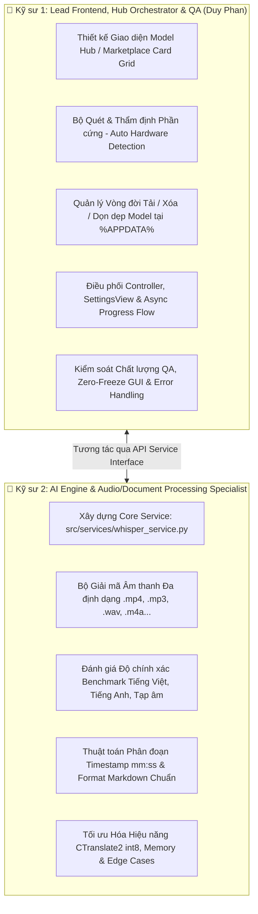
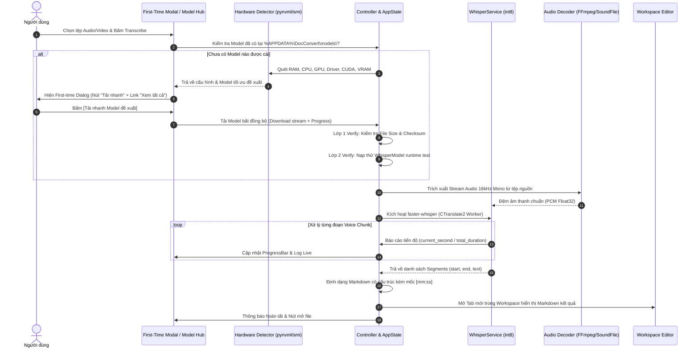
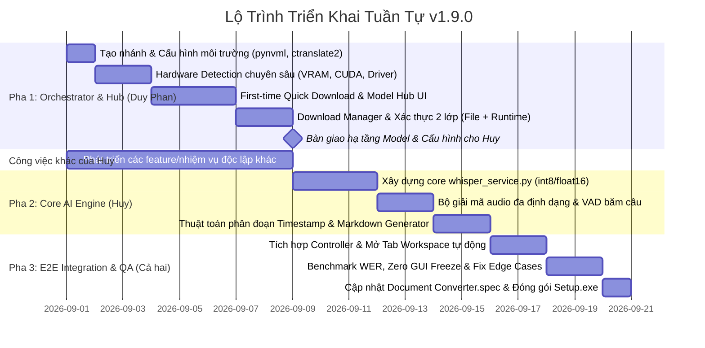

# 🎙️ Audio/Video Transcriber (Whisper AI) & Model Hub Marketplace — Kế Hoạch Kiến Trúc & Phân Công Kỹ Thuật

**Mã định danh**: `FEAT-WHISPER-001`  
**Phiên bản phát hành mục tiêu**: `v1.9.0 (AI-Powered Transcriber & Model Marketplace Release)`  
**Ngày cập nhật**: 29/08/2026  
**Trạng thái**: 🟢 Planning & Architecture Specification  

---

## 1. Tầm nhìn Kiến trúc & Định vị Sản phẩm (Executive Summary & Vision)

Tính năng **Offline Audio/Video Transcriber** không đơn thuần là một nút bấm chuyển đổi tệp, mà là bước chuyển mình quan trọng đưa **Document Converter Tool** tiến vào kỷ nguyên **Local AI / Edge Computing**.

Ứng dụng được thiết kế theo mô hình **AI Model Hub / Model Marketplace**:
1. **Quyền tự chủ của người dùng (User Autonomy)**: Người dùng toàn quyền quyết định tải, trải nghiệm, chuyển đổi hoặc xóa các mô hình AI (`tiny`, `base`, `small`, `PhoWhisper`...) tùy theo nhu cầu độ chính xác và cấu hình phần cứng của máy tính.
2. **Ứng dụng làm Bộ điều phối trung gian (Smart AI Orchestrator)**:
   - Tự động thẩm định phần cứng máy tính (RAM, số nhân CPU, GPU CUDA) để đưa ra khuyến nghị model phù hợp nhất.
   - Quản lý tải xuống, lưu trữ và giải phóng bộ nhớ model cục bộ tại `%APPDATA%\DocConvert\models\`.
   - Phân luồng tác vụ giải mã âm thanh và nhận diện giọng nói chạy nền (Background Worker), tự động xuất ra tài liệu Markdown có cấu trúc kèm mốc thời gian `[mm:ss]` đưa thẳng vào Studio Workspace.
3. **Bộ cài đặt siêu nhẹ (`Setup.exe`)**: Áp dụng chiến lược **Tải Model Theo Nhu Cầu (On-demand Download)**, không bundle file weights nặng hàng trăm MB vào bộ cài đặt ban đầu, giữ file cài đặt luôn gọn nhẹ (< 80MB).

---

## 2. Ma trận Phân công Trách nhiệm Kỹ thuật (2-Person Responsibility Matrix)

Dự án được chia tách thành 2 mảng chuyên môn độc lập để tối đa hóa hiệu suất và chất lượng sản phẩm:



### Chi tiết Phân công Nhiệm vụ:

| Hạng mục | 👤 Kỹ sư 1: Lead Frontend & Orchestrator (Duy Phan) | 👤 Kỹ sư 2: AI & Processing Specialist (Huy) |
| :--- | :--- | :--- |
| **Giao diện & Trải nghiệm (UI/UX)** | • Thiết kế Marketplace Card Grid (Thẻ model, badge sao ⭐, tốc độ 🚀, RAM, VRAM).<br>• Thanh trạng thái dung lượng ổ cứng & Modal tải model.<br>• **First-time Quick Download Dialog**: Đề xuất model tối ưu nhất theo phần cứng (nút *"Tải nhanh"*) + link phụ *"Xem tất cả model"* dẫn tới Hub.<br>• Tích hợp vào `SettingsView` và phím tắt trên `ActivityBar`. | • Tham vấn các thông số kỹ thuật cần hiển thị cho từng model.<br>• Phối hợp thiết kế hiển thị log nhận diện giọng nói thời gian thực. |
| **Động cơ AI & Xử lý Âm thanh** | • Điều phối gọi hàm `whisper_service.transcribe_async()`.<br>• Bắt các sự kiện `on_progress` và cập nhật thanh tiến trình. | • Xây dựng module `src/services/whisper_service.py` (`faster-whisper` + CTranslate2 `int8`/`float16`).<br>• Giải mã audio từ video `.mp4`, `.mkv` và audio `.mp3`, `.wav`, `.m4a`, `.aac`, `.flac`. |
| **Quản lý Tài nguyên & Phần cứng** | • **Hardware Detection Chuyên sâu**: Quét chi tiết CPU, RAM, GPU Name, NVIDIA Driver Version, CUDA Toolkit Version, VRAM khả dụng (ưu tiên `pynvml` / `nvidia-smi`, **không cài đặt `torch`** chỉ để detect).<br>• Thuật toán tự động đánh giá phần cứng & gán nhãn *"Khuyên dùng cho cấu hình của bạn"* trên UI.<br>• Kiểm tra dung lượng đĩa trống trước khi tải (`shutil.disk_usage`). | • Xác định ngưỡng phần cứng tối thiểu và tối ưu cho từng model (RAM, VRAM, Compute Type).<br>• Tối ưu hóa số luồng xử lý CPU (`cpu_threads`) chống tràn CPU/RAM. |
| **Định dạng Đầu ra & Tài liệu** | • Nhận kết quả từ Engine và nạp thành Tab mới trong Studio Workspace (`handle_new_doc_tab`).<br>• Tích hợp nút xem trước video/audio đồng bộ với timestamp. | • Thiết kế bộ lọc Voice Activity Detection (VAD) băm câu tự nhiên.<br>• Định dạng Markdown có cấu trúc: Tiêu đề, Tóm tắt nội dung, Bảng phân đoạn `[mm:ss]` và người nói (nếu có). |
| **Kiểm thử & Đảm bảo Chất lượng (QA)** | • **Quy trình Verify 2 Lớp Độc lập**:<br>&nbsp;&nbsp;1. *Lớp 1 (File Integrity)*: Tải model về `%APPDATA%\DocConvert\models\`, kiểm tra file size / sha256 checksum chống corrupt.<br>&nbsp;&nbsp;2. *Lớp 2 (Runtime Load Check)*: Viết test harness độc lập nạp model thử vào `faster_whisper.WhisperModel` kiểm tra nạp thành công mà không phụ thuộc tiến độ pipeline của Specialist.<br>• Kiểm thử thứ tự import (`numpy` trước `ctranslate2`) chống segfault C-extension.<br>• Kiểm thử Zero GUI Freeze khi tải/xử lý file nặng, xử lý mất mạng giữa chừng, bấm Hủy (`Cancel`). | • Benchmark độ chính xác (Word Error Rate - WER) trên tập dữ liệu tiếng Việt đa vùng miền và tiếng Anh.<br>• Xử lý tệp âm thanh có tạp âm lớn, file dài > 2 tiếng. |

## 3. Danh mục AI Model Marketplace & Tiêu chuẩn Phần cứng (v1.9.0 Release)

Hệ thống cung cấp danh mục Model linh hoạt để người dùng tự do lựa chọn theo sức mạnh phần cứng. Trong bản phát hành **v1.9.0**, toàn bộ model được cung cấp trực tiếp từ tổ chức chính thức **Systran** (tác giả của `faster-whisper`) nhằm đảm bảo tính sẵn sàng 100%, độ ổn định lâu dài và bảo mật:

| Model ID | Repo HuggingFace Chính Thức | Tên hiển thị | Kích thước | Độ chính xác | Tốc độ xử lý (CPU) | RAM / VRAM Khuyến nghị | Trường hợp sử dụng tối ưu |
| :--- | :--- | :--- | :---: | :---: | :---: | :---: | :--- |
| `whisper-tiny` | `Systran/faster-whisper-tiny` | **Whisper Tiny** | ~75 MB | ⭐⭐⭐ | 🚀🚀🚀🚀🚀 *(~0.08x)* | $\ge$ 4 GB RAM | Máy cấu hình yếu, ghi chú nhanh, hội thoại ngắn rõ tiếng. |
| `whisper-base` | `Systran/faster-whisper-base` | **Whisper Base (Mặc định)** | ~145 MB | ⭐⭐⭐⭐ | 🚀🚀🚀🚀 *(~0.15x)* | $\ge$ 8 GB RAM | **Lựa chọn cân bằng nhất** cho công việc văn phòng hàng ngày (Đa ngữ: Vi / En). |
| `whisper-small` | `Systran/faster-whisper-small` | **Whisper Small** | ~480 MB | ⭐⭐⭐⭐⭐ | 🚀🚀 *(~0.40x)* | $\ge$ 16 GB RAM hoặc $\ge$ 2GB VRAM | Hội thảo chuyên sâu, bài giảng, nhiều thuật ngữ, độ chính xác cao. |

> *Ghi chú tốc độ: `0.15x` nghĩa là file audio 10 phút sẽ được xử lý trong khoảng ~1.5 phút trên CPU tầm trung.*

> [!NOTE]
> **Kế Hoạch Mở Rộng PhoWhisper (Fast-follow v1.9.1)**:  
> Để phục vụ tối đa người dùng Việt Nam với ngữ điệu đa vùng miền, team sẽ thực hiện convert `vinai/PhoWhisper-base` sang định dạng CTranslate2 bằng `ct2-transformers-converter` và chủ động host trên Repo Hugging Face chính chủ của dự án (thay vì phụ thuộc repo cá nhân trôi nổi của cộng đồng). Tính năng này sẽ được kích hoạt ở bản cập nhật `v1.9.1`.

---

## 4. Thiết Kế Giao Diện AI Model Hub & Marketplace (UI/UX Specification)

### 4.1. Bản vẽ Wireframe Giao diện Model Hub

```
+----------------------------------------------------------------------------------------------------+
|  🧩 AI Model Hub & Marketplace — Offline Speech Transcriber                              _  [ ]  X |
+----------------------------------------------------------------------------------------------------+
|  💻 Phần cứng phát hiện: Intel Core i7 (8 Cores) | 16GB RAM | GPU: RTX 3060 (Driver 551.86, CUDA 12.2, 6GB VRAM)|
|  💡 Gợi ý hệ thống: Phần cứng hỗ trợ tăng tốc GPU CUDA! Đề xuất sử dụng [Whisper Small] hoặc [PhoWhisper]      |
+----------------------------------------------------------------------------------------------------+
|                                                                                                    |
|  [⚡ Whisper Tiny]               [🎯 Whisper Base]               [🇻🇳 PhoWhisper Base]               |
|  Dung lượng: ~75 MB              Dung lượng: ~145 MB             Dung lượng: ~290 MB               |
|  Tốc độ: Siêu nhanh              Tốc độ: Nhanh                   Tốc độ: Cân bằng                  |
|  Chính xác: Cơ bản               Chính xác: Tốt                  Chính xác: Rất cao (Tiếng Việt)   |
|  [ 🟢 ĐÃ CÀI ĐẶT ] [ 🗑️ Xóa ]    [ ⬇️ TẢI VỀ (~145MB) ]          [ ⬇️ TẢI VỀ (~290MB) ]            |
|                                                                                                    |
|  [🧠 Whisper Small]              [⚙️ Tùy chọn nâng cao]                                            |
|  Dung lượng: ~480 MB             • Chế độ xử lý: [ GPU CUDA (int8/float16) ▼ ]                     |
|  Tốc độ: Nhanh (với GPU)         • Ngôn ngữ mặc định: [ Tự động nhận diện ▼ ]                      |
|  Chính xác: Xuất sắc             • Thư mục lưu trữ: %APPDATA%\DocConvert\models\                   |
|  [ ⬇️ TẢI VỀ (~480MB) ]          [ 🧹 Xóa sạch tất cả Model để giải phóng ổ cứng ]                  |
|                                                                                                    |
+----------------------------------------------------------------------------------------------------+
|  📁 Dung lượng Model đã dùng: 75 MB | Ổ đĩa C: còn trống 128.4 GB               [ Đóng ] [ Bắt đầu ]|
+----------------------------------------------------------------------------------------------------+
```

### 4.2. Các Thành phần Trải nghiệm Người dùng (UX Features)

1. **Hộp thoại Tải nhanh Lần đầu (First-time Quick Download Dialog)**:
   - Khi người dùng bấm nhận diện giọng nói mà máy chưa có model nào:
     - Hệ thống chạy quét phần cứng tức thì.
     - Hiển thị Modal đề xuất model tối ưu nhất kèm lý do (ví dụ: *"Phần cứng máy bạn có 16GB RAM & GPU NVIDIA $\rightarrow$ Khuyên dùng Whisper Small"*).
     - Cung cấp nút hành động chính: **[ ⬇️ Tải Nhanh Model Được Đề Xuất (~X MB) ]**.
     - Cung cấp link phụ: *"⚙️ Xem tất cả model & Tùy chỉnh nâng cao"* $\rightarrow$ chuyển tiếp trực tiếp sang Model Hub / Settings.
2. **Thẻ Model (Model Card Widget)**:
   - Đánh giá trực quan qua biểu tượng sao (⭐) và tên lửa tốc độ (🚀).
   - Nút hành động rõ ràng: **Tải về (`Download`)**, **Đã cài đặt (`Ready`)**, **Xóa model (`Delete`)**.
3. **Thanh giám sát ổ cứng (Disk Storage Bar)**:
   - Hiển thị tổng dung lượng model đang chiếm dụng và dung lượng còn trống của ổ đĩa `C:`.
   - Nút 1-click **Dọn dẹp tất cả model** giúp giải phóng bộ nhớ ngay lập tức khi không dùng nữa.
4. **Tiến trình tải thời gian thực (Real-time Download Progress)**:
   - Hiển thị thanh `ft.ProgressBar` kèm tốc độ tải (MB/s) và phần trăm hoàn thành, không làm đơ giao diện.

---

## 5. Kiến Trúc Pipeline Xử Lý Âm Thanh & Luồng Tải Model



---

## 6. Tiêu Chuẩn Kỹ Thuật & Đóng Gói (Technical Standards & Delivery)

1. **Hardware Detection Thuần Nhẹ (No PyTorch Overhead)**:
   - Thu thập thông tin GPU NVIDIA bằng `pynvml` hoặc fallback qua lệnh CLI `nvidia-smi --query-gpu=... --format=csv,noheader,nounits`.
   - Lấy thông tin chi tiết: Tên GPU, Phiên bản Driver, CUDA Version hỗ trợ, VRAM khả dụng / tổng VRAM.
   - Tránh import `torch` (tiết kiệm ~2-3GB dung lượng bundle và tránh khởi tạo CUDA context nặng nề chỉ để đọc thông số).

2. **Quy Trình Kiểm Tra & Xác Thực 2 Lớp (2-Layer Verification Harness)**:
   - **Lớp 1 (Download & Storage Verification)**:
     - Tải đầy đủ các file trọng số (`model.bin`, `config.json`, `vocabulary.txt`, `tokenizer.json`...) vào `%APPDATA%\DocConvert\models\<model_name>\`.
     - Kiểm tra kích thước file và hash checksum để đảm bảo không bị lỗi đứt gãy mạng giữa chừng.
   - **Lớp 2 (Runtime Load Independent Test)**:
     - Frontend / QA Engineer có thể kiểm thử độc lập mà không cần chờ toàn bộ audio pipeline:
     ```python
     from faster_whisper import WhisperModel
     
     def verify_model_runtime(model_dir: str, device: str = "cpu") -> bool:
         try:
             # Kiểm tra nạp trọng số CTranslate2 vào bộ nhớ
             model = WhisperModel(model_dir, device=device, compute_type="int8")
             return True
         except Exception as e:
             logger.error(f"Runtime model verification failed: {e}")
             return False
     ```

3. **Danh Mục Thư Viện Phụ Thuộc & Khóa Phiên Bản An Toàn (Strict Dependency Version Lock)**:
   
   Dự án vận hành trên **Python 3.12.0 (Windows)**. Để đảm bảo tính tái lập 100% (Deterministic Build), tránh xung đột binary DLL và ngăn chặn `pip` cài đặt phiên bản không mong muốn, toàn bộ thư viện được **khóa cứng tuyệt đối bằng toán tử `==`**:

   | Gói thư viện | Phiên bản khóa cứng | Mục đích sử dụng | Đánh giá an toàn & Ghi chú kỹ thuật chính xác |
   | :--- | :---: | :--- | :--- |
   | `faster-whisper` | `==1.2.1` | Whisper Engine tốc độ cao (CTranslate2) | Phiên bản mới nhất, tối ưu CTranslate2, không kéo theo PyTorch (~2.5GB). |
   | `ctranslate2` | `==4.8.1` | Inference Engine C++ tối ưu CPU/GPU | **Bản mới nhất (07/2026)**: Hỗ trợ cuDNN 9, Multi-Query Attention (MQA), bfloat16/int8_bfloat16, sửa lỗi timestamp khi dùng prefix, có sẵn wheel Windows Python 3.12. Nằm trong dải `ctranslate2<5,>=4.0` của faster-whisper. |
   | `nvidia-ml-py` | `==13.610.43` | Quét phần cứng NVIDIA (Driver, CUDA, VRAM) | ⚠️ **Khóa cứng version**: Gói cũ `pynvml` đã deprecated. Khóa `==13.610.43` để chặn triệt để lỗi `pip` trên Windows tự động cài bản cổ đại `375.53`. |
   | `huggingface-hub` | `==1.28.0` | Quản lý tải weights model snapshot | Khóa cứng bản phát hành ổn định, hỗ trợ resume download, kiểm tra sha256 checksum tải về `%APPDATA%\DocConvert\models\`. |
   | `av` *(PyAV)* | `==18.1.0` | Giải mã luồng audio từ video/audio đa định dạng | Khóa cứng bản mới nhất có sẵn prebuilt FFmpeg shared C-libraries cho Windows, tránh nguy cơ `pip` build from source khi bản cũ bị gỡ wheel. |
   | `numpy` | *(Theo môi trường)* | Đệm mảng âm thanh PCM Float32 | Môi trường máy hiện có `numpy 2.4.6` (hỗ trợ `pandas 3.0.3`). Giữ nguyên phiên bản môi trường để không gây xung đột với các module dữ liệu khác. |

4. **Cấu hình Đóng gói PyInstaller (`Document Converter.spec`)**:
   - Bổ sung `hiddenimports`: `faster_whisper`, `ctranslate2`, `nvidia_ml_py`, `av`, `huggingface_hub`.
   - Không đóng gói file trọng số models vào bộ cài `Setup.exe` (giữ dung lượng app < 80MB).

5. **Quy Tắc An Toàn Thứ Tự Import (Import Order Runtime Safety Rule)**:
   - ⚠️ **Rủi ro Segfault / Symbol Lookup Error**: Trên các C-extension, thứ tự import giữa `numpy` và `ctranslate2` có thể gây lỗi bộ nhớ nếu `ctranslate2` được load trước khi `numpy` khởi tạo runtime symbols.
   - **Quy tắc bắt buộc**: Trong `whisper_service.py` hoặc bất kỳ module nào nạp model, **luôn đảm bảo `import numpy as np` được thực thi trước `import ctranslate2` / `from faster_whisper import WhisperModel`**.
   - Bổ sung test case kiểm tra thứ tự import trong Unit Test / QA Checklist.

6. **Bảo toàn Kiến trúc MVC & Lazy Loading**:
   - Tuân thủ quy chuẩn `doc-convert-dev`: Tất cả các thư viện trên được **Lazy Import** bên trong phương thức thực thi, không import ở module top-level để không ảnh hưởng đến tốc độ khởi động của ứng dụng.
   - Tách biệt hoàn toàn `whisper_service.py` (AI Engine) và `speech_service.py` (Non-AI Google API cũ).
   - Mọi tác vụ download, decode và inference chạy trong `ThreadPoolExecutor` hoặc `asyncio.to_thread`.

---

## 7. Kế Hoạch Triển Khai Tuần Tự (Sequential Execution Roadmap — v1.9.0)

Chiến lược triển khai tuân thủ mô hình **Tuần tự (Sequential Handoff)** nhằm tránh phụ thuộc chéo và loại bỏ thời gian chết (deadlock):
- **Pha 1 (Duy Phan thực hiện trước)**: Xây dựng hoàn chỉnh tầng Orchestration, Hardware Detection, Giao diện Model Hub, Trình tải xuống & Kiểm thử 2 lớp độc lập.
- **Trong lúc này (Huy)**: Tập trung phát triển các tính năng/nhiệm vụ khác của dự án, không cần tham gia sớm để tránh xung đột hoặc chờ đợi.
- **Pha 2 (Huy bắt đầu sau khi Pha 1 hoàn tất & bàn giao)**: Triển khai Core AI Engine `whisper_service.py`, bộ giải mã âm thanh và pipeline xử lý văn bản dựa trên hạ tầng model đã sẵn sàng.
- **Pha 3 (Phối hợp hoàn thiện & Đóng gói)**: Kết nối Controller, kiểm thử toàn trình End-to-End (E2E) và đóng gói phát hành.



### Bảng Chi Tiết Tiến Độ Theo Từng Giai Đoạn:

| Giai đoạn | Nhiệm vụ chính | Chi tiết công việc | Người thực hiện | Trạng thái |
| :---: | :--- | :--- | :---: | :---: |
| **Pha 1**<br>*(Tuần 1)* | **Orchestrator, Hardware Hub & 2-Layer Verification** | • Tạo nhánh `feat/duy-DDMMYYYY-whisper-model-hub`.<br>• Cài đặt & cấu hình `faster-whisper`, `ctranslate2`, `pynvml`.<br>• Viết module Hardware Detection (`pynvml`/`nvidia-smi` quét Driver, CUDA, VRAM, RAM, CPU).<br>• Xây dựng `First-time Quick Download Dialog` và `ModelHubDialog`.<br>• Xây dựng Download Manager + Quy trình Verify 2 lớp (File Hash & Runtime Test độc lập).<br>🏁 **Mốc bàn giao**: Hạ tầng tải/quản lý model và runtime load đã được test độc lập thành công. | 👤 **Duy Phan** | ✅ **Hoàn thành** |
| **Pha 2**<br>*(Tuần 2)* | **Core AI Engine & Processing Pipeline** | • Xây dựng module `src/services/whisper_service.py` dựa trên model đã được tải sẵn ở Pha 1.<br>• Xây dựng bộ giải mã âm thanh từ `.mp4`, `.mkv`, `.mp3`, `.wav`, `.m4a`, `.flac`, `.aac`, `.webm` (PyAV).<br>• Chuẩn hóa 16kHz mono, triệt tiêu DC offset, volume normalization -0.9 dBFS.<br>• Tích hợp VAD lọc tạp âm, băm câu tự nhiên theo khoảng lặng và sinh mốc thời gian `[mm:ss]`.<br>• Format tài liệu Markdown chuẩn chỉnh có bảng metadata.<br>• Xây dựng `AudioModule` tích hợp vào hệ thống `ModuleRegistry`. | 👤 **Huy**<br>*(AI Specialist)* | ✅ **Hoàn thành** |
| **Pha 3**<br>*(Tuần 3)* | **Tích hợp Toàn diện (E2E), QA & Đóng gói v1.9.0** | • Xây dựng `TranscribeDialog` chuyên dụng cho tệp âm thanh/video cục bộ.<br>• Kết nối Controller với `whisper_service.transcribe_file()`.<br>• Đưa kết quả nhận diện tự động mở thành Tab mới trong Studio Workspace.<br>• Tích hợp nút khởi chạy trên Ribbon Bar (`btn_transcribe`) và Welcome View (`card_transcribe`).<br>• Gỡ bỏ phụ thuộc thừa `SpeechRecognition`, cập nhật `Document Converter.spec` (`hiddenimports`).<br>• Viết bộ Unit Test `test_whisper_service.py`, bảo đảm 100% test suite (176/176 tests) passed cleanly. | 👥 **Duy Phan & Huy**<br>*(Phối hợp)* | ✅ **Hoàn thành** |

