# Mermaid Test Suite — Manual QA Checklist

> Dùng file này để test module `preview_view.py` (Interceptor render Mermaid → SVG/PNG base64).
> Check từng ô sau khi render đúng, không lỗi, không treo webview.

- [ ] Flowchart
- [ ] Sequence
- [ ] Class# Mermaid Test Suite — Manual QA Checklist

> Check từng ô sau khi render đúng, không lỗi, không treo webview.

- [ ] Flowchart
- [ ] Sequence
- [ ] Class
- [ ] State
- [ ] ER
- [ ] Gantt
- [ ] Git Graph
- [ ] Pie
- [ ] Mindmap
- [ ] User Journey
- [ ] Timeline
- [ ] Quadrant
- [ ] C4 Context
- [ ] Multiple diagrams trong cùng 1 file (stress test)
- [ ] Diagram lỗi cú pháp (error handling test)

---

## 1. Flowchart (ưu tiên QA kỹ)

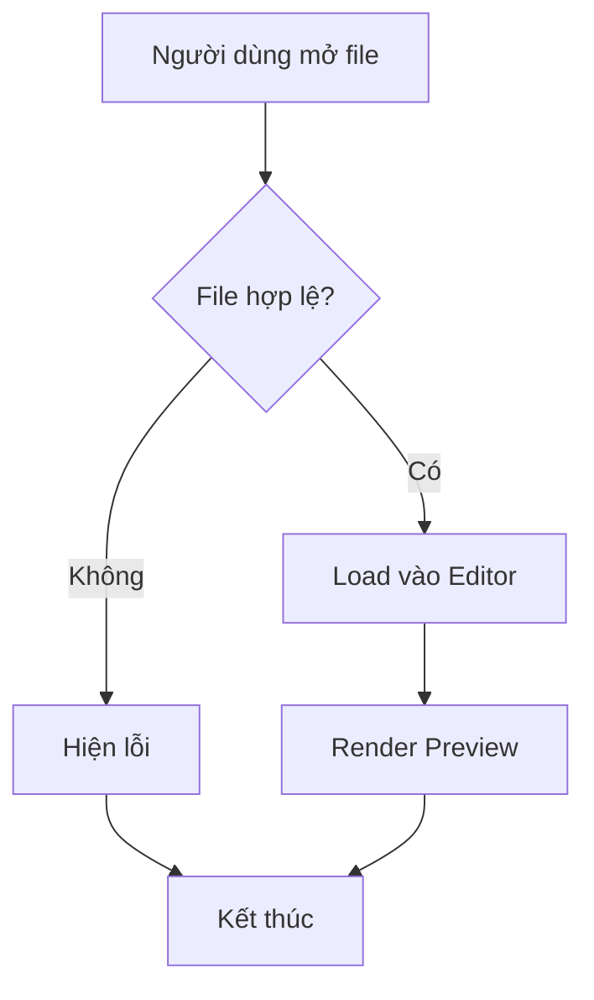

---

## 2. Sequence Diagram (ưu tiên QA kỹ)

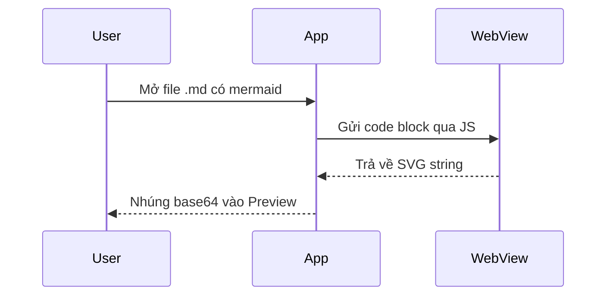

---

## 3. Class Diagram

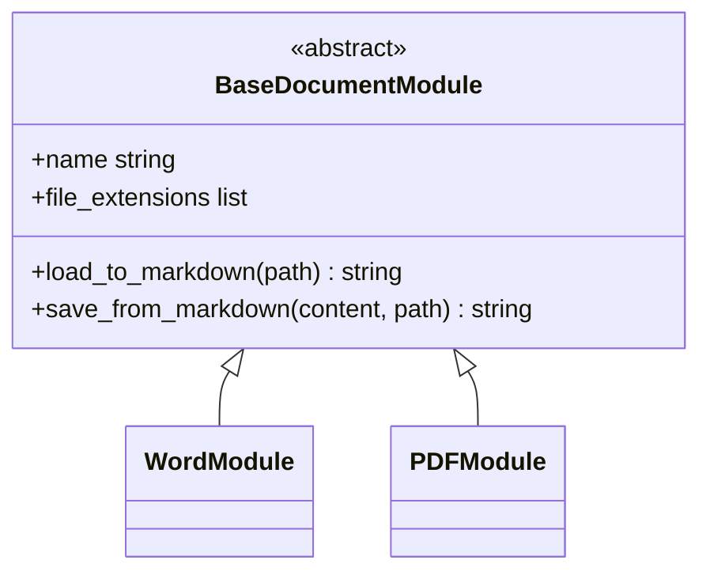

---

## 4. State Diagram (ưu tiên QA kỹ)

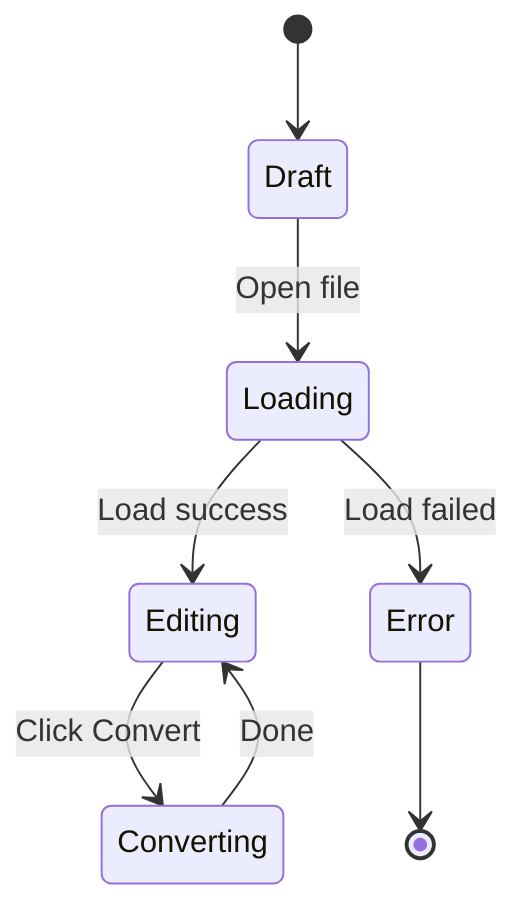

---

## 5. ER Diagram (ưu tiên QA kỹ)

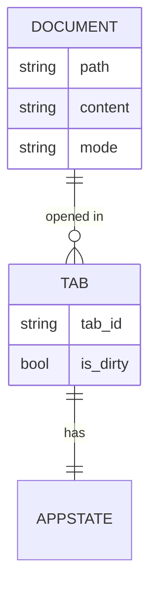

---

## 6. Gantt Chart

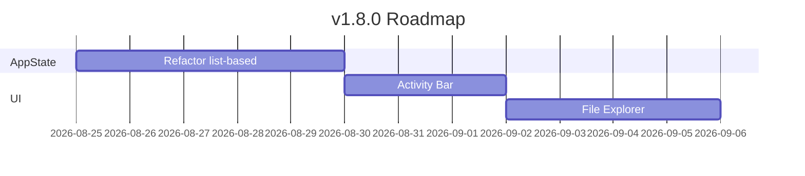

---

## 7. Git Graph

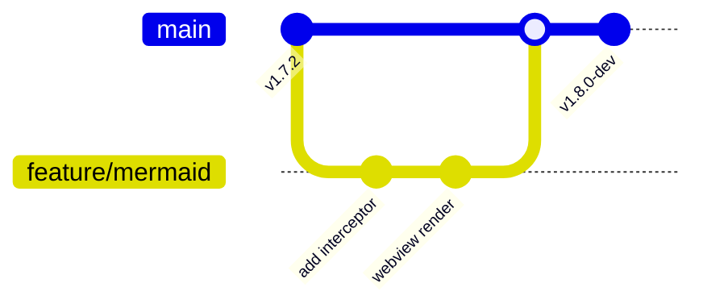

---

## 8. Pie Chart

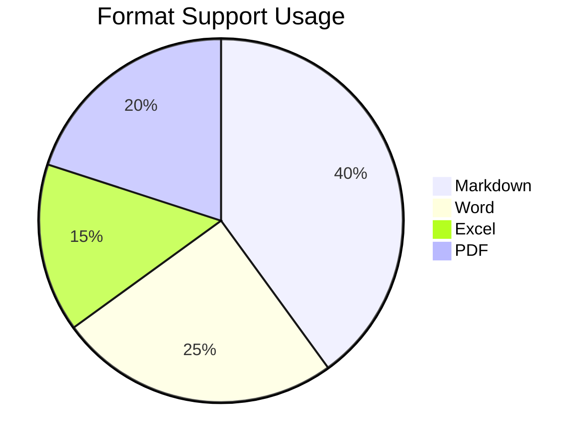

---

## 9. Mindmap

```mermaid

mindmap

  root((DocConvert))

    Modules

      Word

      Excel

      PDF

      PPTX

    UI

      Ribbon Bar

      Workspace

    v2.0

      Wikilink

      Backlink Panel

```

---

## 10. User Journey

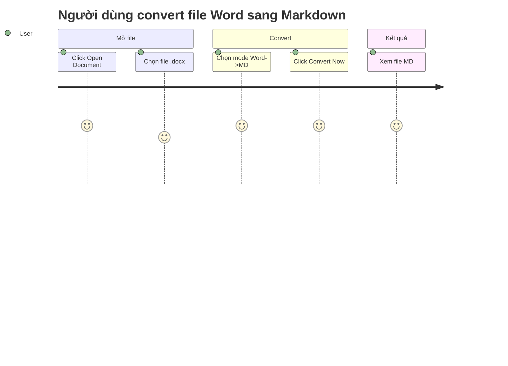

---

## 11. Timeline

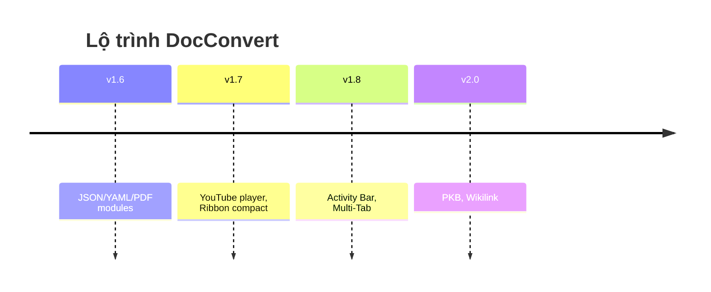

---

## 12. Quadrant Chart

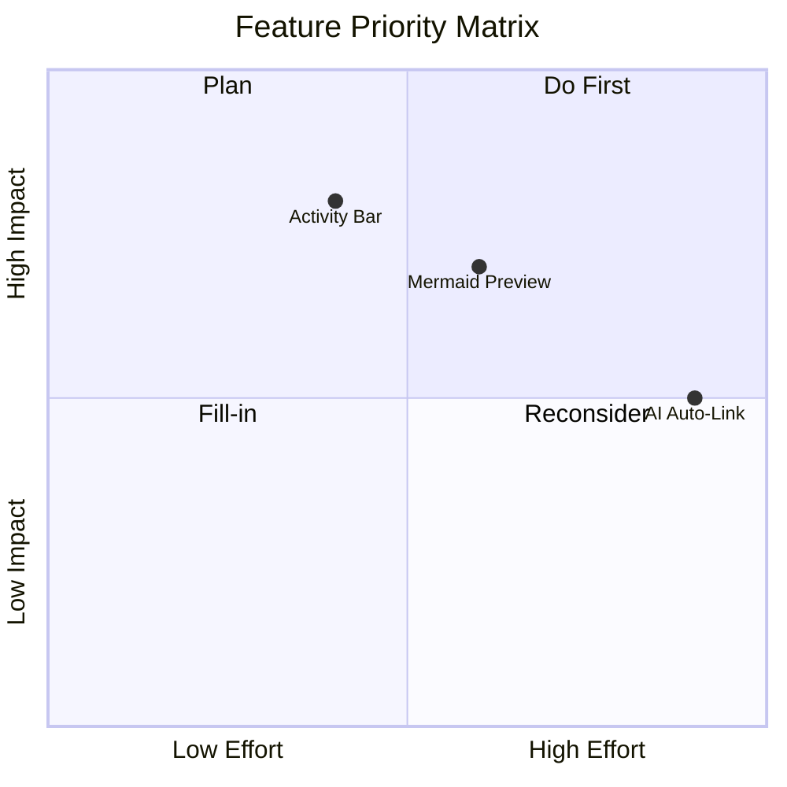

---

## 13. C4 Context Diagram

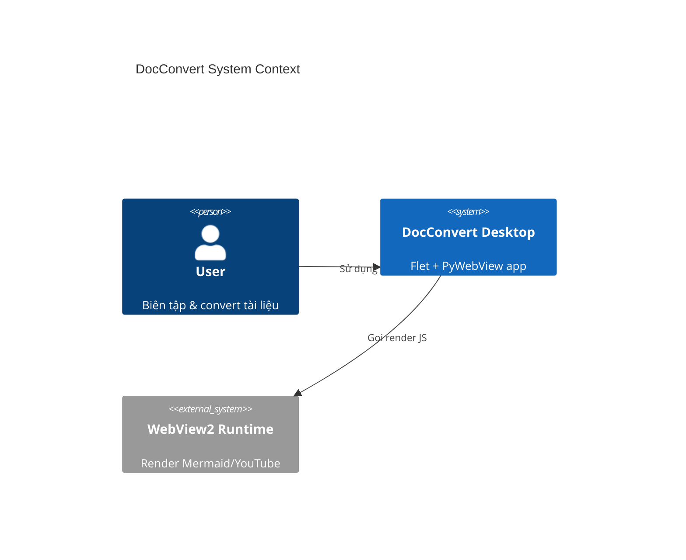

---

## 14. Stress Test — Nhiều Diagram Liên Tiếp

Đoạn text bình thường xen giữa các diagram để test parser không bị lẫn.

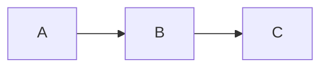

Một đoạn text khác ở giữa.

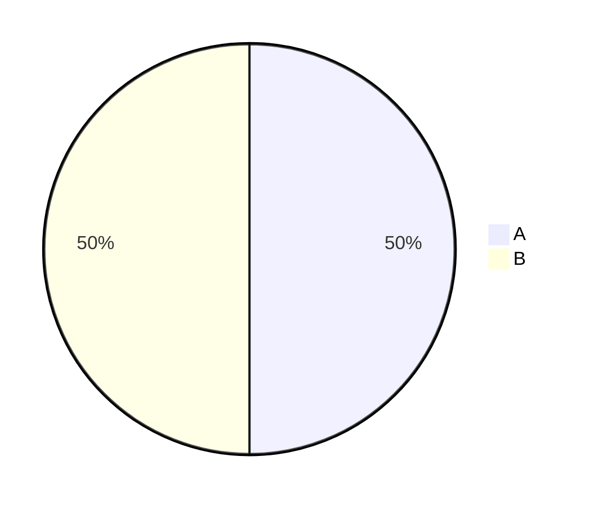

Kết thúc bằng bảng Markdown thường (không phải mermaid) để test Interceptor không bắt nhầm:

| Cột 1 | Cột 2 |

|---|---|

| a | b |

---

## 15. Cú Pháp Lỗi (Error Handling Test)

```mermaid

flowchart TD

    A[Thiếu ngoặc đóng --> B

```

> Kỳ vọng: Preview hiện thông báo lỗi rõ ràng (VD: "⚠️ Mermaid syntax error"), **không crash app, không treo webview**, các diagram khác trong cùng file vẫn render bình thường.

- [ ] State
- [ ] ER
- [ ] Gantt# Mermaid Test Suite — Manual QA Checklist
- [ ] Flowchart
- [ ] Sequence
- [ ] Class
- [ ] State
- [ ] ER
- [ ] Gantt
- [ ] Git Graph
- [ ] Pie
- [ ] Mindmap
- [ ] User Journey
- [ ] Timeline
- [ ] Quadrant
- [ ] C4 Context
- [ ] Multiple diagrams trong cùng 1 file (stress test)
- [ ] Diagram lỗi cú pháp (error handling test)

---

## 1. Flowchart (ưu tiên QA kỹ)


---

## 2. Sequence Diagram (ưu tiên QA kỹ)


---

## 3. Class Diagram


---

## 4. State Diagram (ưu tiên QA kỹ)


---

## 5. ER Diagram (ưu tiên QA kỹ)

```mermaid

erDiagram

    DOCUMENT ||--o{ TAB : "opened in"

    TAB ||--|| APPSTATE : "has"

    DOCUMENT {

        string path

        string content

        string mode

    }

    TAB {

        string tab_id

        bool is_dirty

    }

```

---

## 6. Gantt Chart

```mermaid

gantt

    title v1.8.0 Roadmap

    dateFormat YYYY-MM-DD

    section AppState

    Refactor list-based    :a1, 2026-08-25, 5d

    section UI

    Activity Bar           :a2, after a1, 3d

    File Explorer          :a3, after a2, 4d

```

---

## 7. Git Graph

```mermaid

gitGraph

    commit id: "v1.7.2"

    branch feature/mermaid

    checkout feature/mermaid

    commit id: "add interceptor"

    commit id: "webview render"

    checkout main

    merge feature/mermaid

    commit id: "v1.8.0-dev"

```

---

## 8. Pie Chart

```mermaid

pie title Format Support Usage

    "Markdown" : 40

    "Word" : 25

    "Excel" : 15

    "PDF" : 20

```

---

## 9. Mindmap

```mermaid

mindmap

  root((DocConvert))

    Modules

      Word

      Excel

      PDF

      PPTX

    UI

      Ribbon Bar

      Workspace

    v2.0

      Wikilink

      Backlink Panel

```

---

## 10. User Journey

```mermaid

journey

    title Người dùng convert file Word sang Markdown

    section Mở file

      Click Open Document: 5: User

      Chọn file .docx: 4: User

    section Convert

      Chọn mode Word->MD: 5: User

      Click Convert Now: 5: User

    section Kết quả

      Xem file MD: 5: User

```

---

## 11. Timeline

```mermaid

timeline

    title Lộ trình DocConvert

    v1.6 : JSON/YAML/PDF modules

    v1.7 : YouTube player, Ribbon compact

    v1.8 : Activity Bar, Multi-Tab

    v2.0 : PKB, Wikilink

```

---

## 12. Quadrant Chart

```mermaid

quadrantChart

    title Feature Priority Matrix

    x-axis Low Effort --> High Effort

    y-axis Low Impact --> High Impact

    quadrant-1 Do First

    quadrant-2 Plan

    quadrant-3 Fill-in

    quadrant-4 Reconsider

    Mermaid Preview: [0.6, 0.7]

    Activity Bar: [0.4, 0.8]

    AI Auto-Link: [0.9, 0.5]

```

---

## 13. C4 Context Diagram

```mermaid

C4Context

    title DocConvert System Context

    Person(user, "User", "Biên tập & convert tài liệu")

    System(docconvert, "DocConvert Desktop", "Flet + PyWebView app")

    System_Ext(webview2, "WebView2 Runtime", "Render Mermaid/YouTube")

    Rel(user, docconvert, "Sử dụng")

    Rel(docconvert, webview2, "Gọi render JS")

```

---

## 14. Stress Test — Nhiều Diagram Liên Tiếp

Đoạn text bình thường xen giữa các diagram để test parser không bị lẫn.

```mermaid

flowchart LR

    A --> B --> C

```

Một đoạn text khác ở giữa.

```mermaid

pie

    "A" : 50

    "B" : 50

```

Kết thúc bằng bảng Markdown thường (không phải mermaid) để test Interceptor không bắt nhầm:

| Cột 1 | Cột 2 |

|---|---|

| a | b |

---

## 15. Cú Pháp Lỗi (Error Handling Test)

```mermaid

flowchart TD

    A[Thiếu ngoặc đóng --> B

```

> Kỳ vọng: Preview hiện thông báo lỗi rõ ràng (VD: "⚠️ Mermaid syntax error"), **không crash app, không treo webview**, các diagram khác trong cùng file vẫn render bình thường.

- [ ] Git Graph
- [ ] Pie
- [ ] Mindmap
- [ ] User Journey
- [ ] Timeline
- [ ] Quadrant
- [ ] C4 Context
- [ ] Multiple diagrams trong cùng 1 file (stress test)
- [ ] Diagram lỗi cú pháp (error handling test)

---

## 1. Flowchart (ưu tiên QA kỹ)

```mermaid
flowchart TD
    A[Người dùng mở file] --> B{File hợp lệ?}
    B -->|Có| C[Load vào Editor]
    B -->|Không| D[Hiện lỗi]
    C --> E[Render Preview]
    D --> F[Kết thúc]
    E --> F
```

---

## 2. Sequence Diagram (ưu tiên QA kỹ)

```mermaid
sequenceDiagram
    participant User
    participant App
    participant WebView
    User->>App: Mở file .md có mermaid
    App->>WebView: Gửi code block qua JS
    WebView-->>App: Trả về SVG string
    App-->>User: Nhúng base64 vào Preview
```

---

## 3. Class Diagram

```mermaid
classDiagram
    class BaseDocumentModule {
        <<abstract>>
        +name string
        +file_extensions list
        +load_to_markdown(path) string
        +save_from_markdown(content, path) string
    }
    class WordModule
    class PDFModule
    BaseDocumentModule <|-- WordModule
    BaseDocumentModule <|-- PDFModule
```

---

## 4. State Diagram (ưu tiên QA kỹ)

```mermaid
stateDiagram-v2
    [*] --> Draft
    Draft --> Loading: Open file
    Loading --> Editing: Load success
    Loading --> Error: Load failed
    Editing --> Converting: Click Convert
    Converting --> Editing: Done
    Error --> [*]
```

---

## 5. ER Diagram (ưu tiên QA kỹ)

```mermaid
erDiagram
    DOCUMENT ||--o{ TAB : "opened in"
    TAB ||--|| APPSTATE : "has"
    DOCUMENT {
        string path
        string content
        string mode
    }
    TAB {
        string tab_id
        bool is_dirty
    }
```

---

## 6. Gantt Chart

```mermaid
gantt
    title v1.8.0 Roadmap
    dateFormat YYYY-MM-DD
    section AppState
    Refactor list-based    :a1, 2026-08-25, 5d
    section UI
    Activity Bar           :a2, after a1, 3d
    File Explorer          :a3, after a2, 4d
```

---

## 7. Git Graph

```mermaid
gitGraph
    commit id: "v1.7.2"
    branch feature/mermaid
    checkout feature/mermaid
    commit id: "add interceptor"
    commit id: "webview render"
    checkout main
    merge feature/mermaid
    commit id: "v1.8.0-dev"
```

---

## 8. Pie Chart

```mermaid
pie title Format Support Usage
    "Markdown" : 40
    "Word" : 25
    "Excel" : 15
    "PDF" : 20
```

---

## 9. Mindmap

```mermaid
mindmap
  root((DocConvert))
    Modules
      Word
      Excel
      PDF
      PPTX
    UI
      Ribbon Bar
      Workspace
    v2.0
      Wikilink
      Backlink Panel
```

---

## 10. User Journey

```mermaid
journey
    title Người dùng convert file Word sang Markdown
    section Mở file
      Click Open Document: 5: User
      Chọn file .docx: 4: User
    section Convert
      Chọn mode Word->MD: 5: User
      Click Convert Now: 5: User
    section Kết quả
      Xem file MD: 5: User
```

---

## 11. Timeline

```mermaid
timeline
    title Lộ trình DocConvert
    v1.6 : JSON/YAML/PDF modules
    v1.7 : YouTube player, Ribbon compact
    v1.8 : Activity Bar, Multi-Tab
    v2.0 : PKB, Wikilink
```

---

## 12. Quadrant Chart

```mermaid
quadrantChart
    title Feature Priority Matrix
    x-axis Low Effort --> High Effort
    y-axis Low Impact --> High Impact
    quadrant-1 Do First
    quadrant-2 Plan
    quadrant-3 Fill-in
    quadrant-4 Reconsider
    Mermaid Preview: [0.6, 0.7]
    Activity Bar: [0.4, 0.8]
    AI Auto-Link: [0.9, 0.5]
```

---

## 13. C4 Context Diagram

```mermaid
C4Context
    title DocConvert System Context
    Person(user, "User", "Biên tập & convert tài liệu")
    System(docconvert, "DocConvert Desktop", "Flet + PyWebView app")
    System_Ext(webview2, "WebView2 Runtime", "Render Mermaid/YouTube")
    Rel(user, docconvert, "Sử dụng")
    Rel(docconvert, webview2, "Gọi render JS")
```

---

## 14. Stress Test — Nhiều Diagram Liên Tiếp

Đoạn text bình thường xen giữa các diagram để test parser không bị lẫn.

```mermaid
flowchart LR
    A --> B --> C
```

Một đoạn text khác ở giữa.

```mermaid
pie
    "A" : 50
    "B" : 50
```

Kết thúc bằng bảng Markdown thường (không phải mermaid) để test Interceptor không bắt nhầm:

| Cột 1 | Cột 2 |
| ------ | ------ |
| a      | b      |

---

## 15. Cú Pháp Lỗi (Error Handling Test)

```mermaid
flowchart TD
    A[Thiếu ngoặc đóng --> B
```

> Kỳ vọng: Preview hiện thông báo lỗi rõ ràng (VD: "⚠️ Mermaid syntax error"), **không crash app, không treo webview**, các diagram khác trong cùng file vẫn render bình thường.
